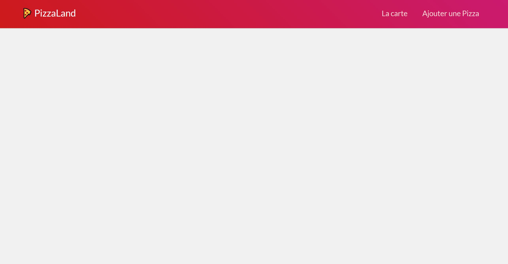
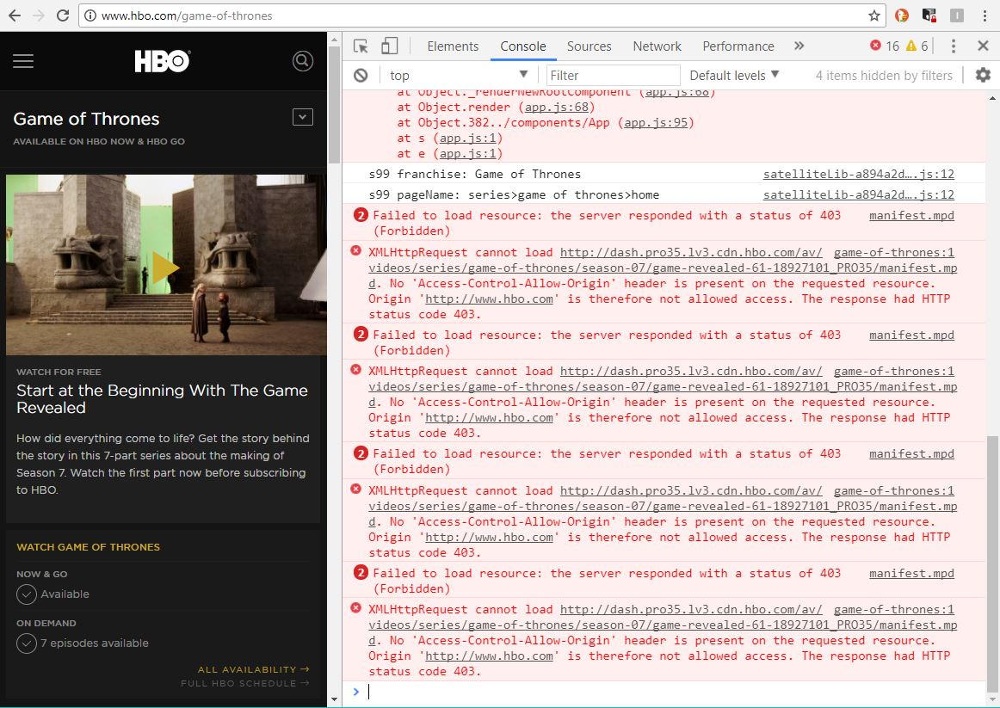
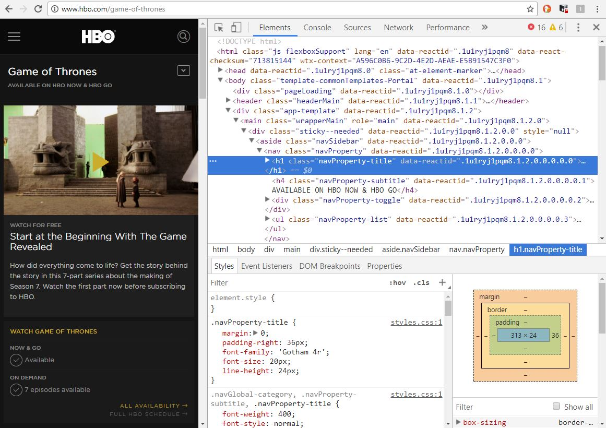
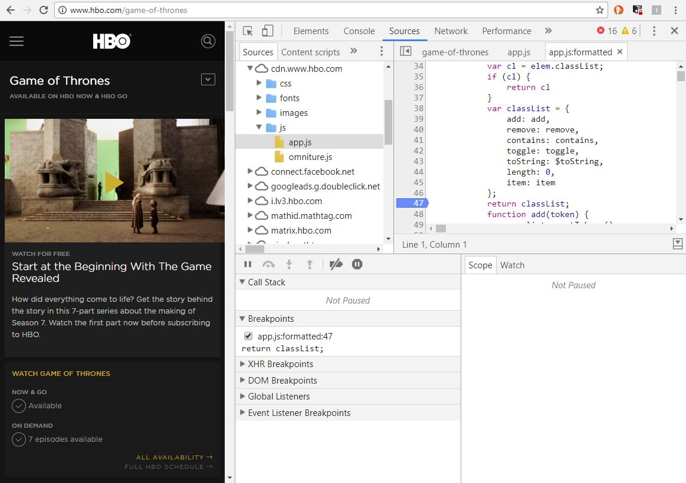
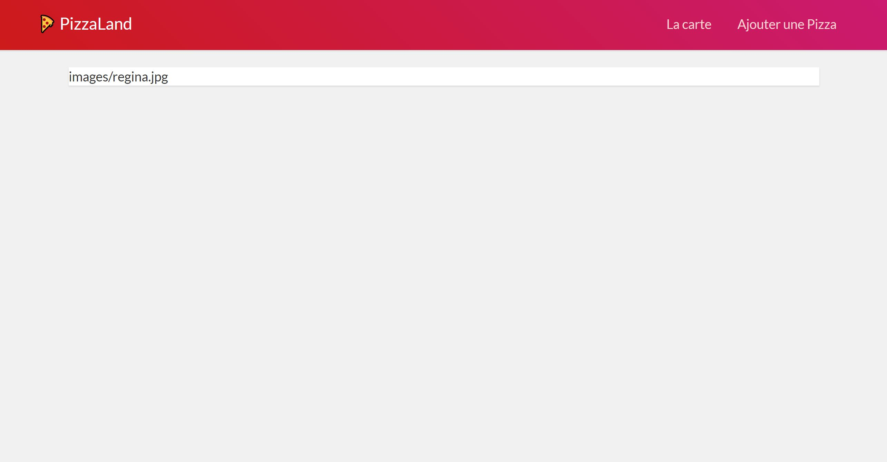
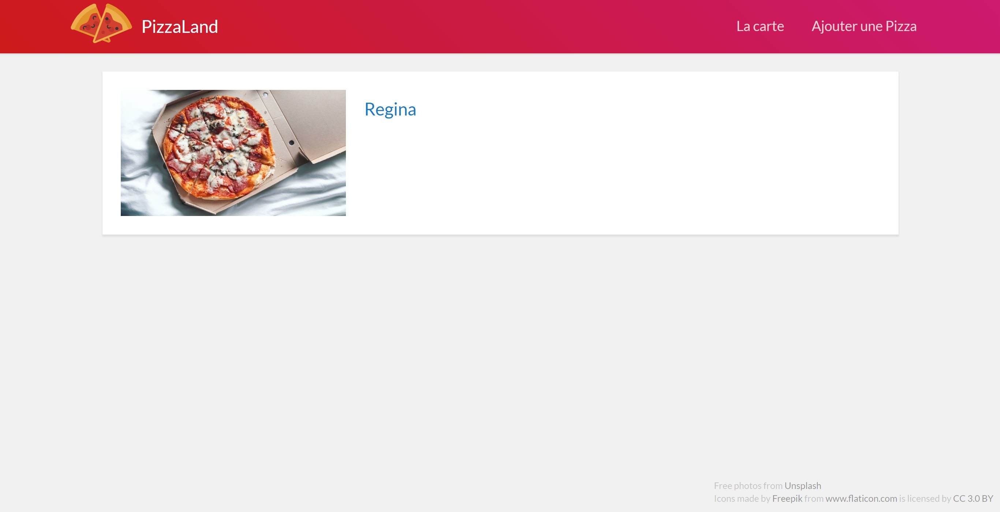
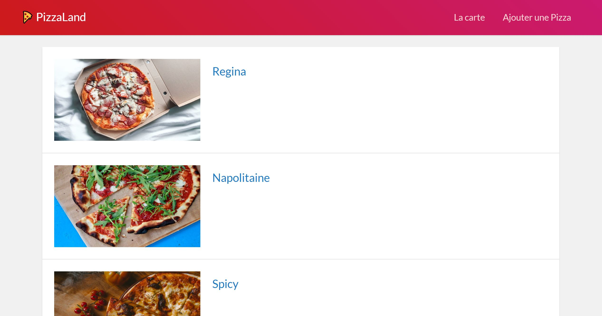
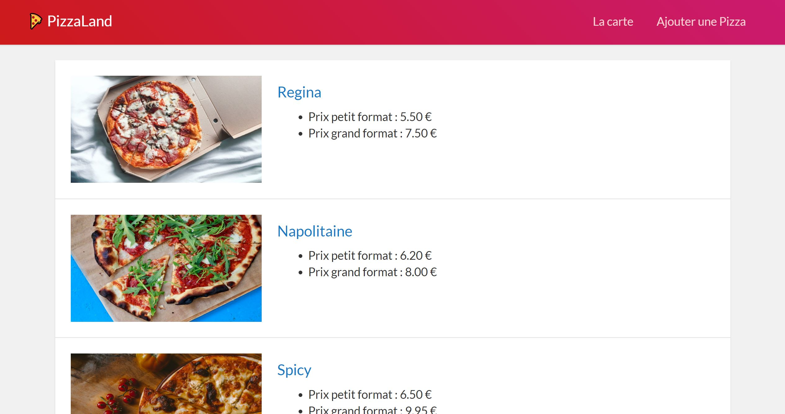

# TP 1 - Premiers pas

## Objectifs
- Mettre en place son environnement de développement
- prendre en main les outils de debug (devtools)
- manipuler les types et fonctions de base de JavaScript
- et en profiter pour poser les bases de l'application ***"Pizzaland"*** 🍕 que nous développerons tout au long des différents TPs

## Préparatifs
1. **Créer un dossier pour ce TP et y placer le contenu du dossier de démarrage fourni dans ce repo.**
2. **Lancer un serveur http dans le dossier créé** :
	```bash
	cd /chemin/vers/votre/dossier/demarrage
	python3 -m http.server 8000
	```
	python se met alors en attente d'une connexion http et affiche une ligne du type :
	```bash
	Serving HTTP on 0.0.0.0 port 8000 ...
	```

	**NB:** *Si vous utilisez votre propre machine et que vous ne disposez pas de python3, vous pouvez installer un serveur http comme [XAMPP](https://www.apachefriends.org/fr/index.html), placer vos fichiers le dossier `htdocs` du répertoire d'installation puis tester votre page sur http://localhost.*
3. **Vérifier dans le navigateur que la page index.html fournie s'affiche correctement** en ouvrant l'url http://localhost:8000. Le résultat attendu est le suivant : <br><a href="images/pizzaland-00.jpg"></a>

	*Si la page ne s'affiche pas correctement, vérifiez que vous avez bien lancé python dans le dossier de démarrage, c'est à dire celui où se trouve le fichier `index.html`.*
4. **Installer un éditeur de code optimisé pour le développement web et particulièrement le JS moderne**. Je vous recommande notamment [Visual Studio Code](https://code.visualstudio.com/) (vscode). C'est un éditeur de code opensource et développé avec [Electron](https://electronjs.org/), c'est donc un outil qui est lui-même développé en JS !

	Pour l'installer sur Linux en mode portable (sans les droits d'admin) téléchargez la version .targz [ici](https://code.visualstudio.com/docs/?dv=linux64), décompressez la dans le dossier de votre choix, puis créez un sous-dossier nommé `"data"` dans le répertoire de vscode. Lancer enfin l'exécutable "code".
	<br>Il ne reste plus qu'à ouvrir le dossier du projet en le glissant dans la fenêtre de vscode.

	**Raccourcis clavier utiles :**
	- <kbd>CTRL</kbd>+<kbd>P</kbd> : ouvrir un fichier à partir de son nom
	- <kbd>CTRL</kbd>+<kbd>SHIFT</kbd>+<kbd>P</kbd> : lancer n'importe quelle commande des menus.
	- <kbd>CTRL</kbd>+<kbd>/</kbd> : commenter/décommenter
	- cheat sheet linux : https://code.visualstudio.com/shortcuts/keyboard-shortcuts-linux.pdf

## A. Intégration du JS dans la page

1. **Inclure le fichier `main.js` dans le fichier `index.html`** à l'aide d'une balise `<script>`. (*Pour ouvrir le fichier dans vscode, utilisez le raccourci* <kbd>CTRL</kbd>+<kbd>P</kbd>)<br>

	Comme vu pendant le cours il existe plusieurs manières d'intégrer du code JavaScript dans une page HTML :
	- *en "inline"* c'est à dire directement dans les attributs d'une balise. Dans l'exemple ci-dessous le code JS s'exécutera lorsque l'utilisateur cliquera sur le lien :
		```html
		<a href="#" onclick="alert('Welcome to Westeros');return false;">
			GOT
		</a>
		```
	- dans une balise `<script>`. Le code s'exécute alors au chargement de la page, au moment où le navigateur arrive à cette ligne (le navigateur parse le document html de haut en bas):
		```html
		<script>alert('Bienvenue à Westeros');</script>
		```
	- dans une balise `<script>` avec un attribut `src`. Dans ce cas le code JS peut alors être externalisé dans un fichier distinct. Le code s'exécute lorsque le fichier est chargé :
		```html
		<script src="westeros.js"></script>
		```
	C'est cette dernière technique que nous emploierons car elle permet de bien séparer les responsabilités de notre appli (HTML et JS séparés).

	**Attention :** Pour éviter que le chargement du fichier JS ne bloque le chargement de la page HTML (comportement par défaut), il existe 2 solutions :
	- placer la balise `<script>` en toute fin de fichier html, juste **avant** la balise fermante `</body>`
	- placer la balise `<script>` dans le `<head>` du fichier, mais y ajouter un attribut **`defer`** (cf. [doc](https://developer.mozilla.org/en-US/docs/Web/HTML/Element/script#attr-defer))
	C'est cette dernière solution que je préconise car elle présente l'avantage de ne pas mélanger le contenu du document (le `<body>`) avec des informations annexes comme le chargement de scripts JS (qui relèvent plutôt du `<head>`) par ailleurs le support navigateur est très bon (IE10, Android 3+, iOS 5+, etc.) cf. https://caniuse.com/#feat=script-defer :

2. **Testez la page pour vérifier que le js est correctement chargé** : Ouvrir les outils de développement de votre navigateur (touche <kbd>F12</kbd> sur Chrome) et ouvrir le panneau "Console".
<br>Si le fichier `main.js` est correctement chargé, le texte 'welcome to PizzaLand 🍕 !' doit s'afficher dans la console. En effet, le fichier main.js contient l'instruction
	```js
	console.log('Welcome to PizzaLand 🍕 !');
	```

	Cette instruction `console.log()` permet d'afficher du texte ou des variables dans la console.

**NB :** _Si le texte ne s'affiche pas, c'est probablement que le fichier `main.js` n'est pas correctement intégré dans la page html. <br>Ouvrir le panneau "Network"/"Réseau" des devtools puis recharger la page en désactivant le cache navigateur : touche <kbd>CTRL</kbd>+<kbd>F5</kbd>, ou <kbd>CTRL</kbd>+<kbd>SHIFT</kbd>+<kbd>R</kbd> selon les navigateurs. S'assurer que cette fois le fichier `main.js` figure bien dans la liste des fichiers téléchargés. Si ce n'est toujours pas le cas, c'est que votre balise `<script>` n'est pas correcte (vérifiez le chemin vers le fichier)._

**_Pour la suite du TP, tout le code se fera dans ce fichier `main.js`, le fichier html ne devra pas être modifié !_**

## B. Les devtools

***Lorsque l'on développe en JS, les outils de debug dont on dispose nous sont fournis par le navigateur. Tous les navigateurs (même Internet Explorer...) disposent d'outils de développement. Sur Chrome, pour les afficher c'est donc, comme vu plus haut, la touche <kbd>F12</kbd>. On peut également les afficher en faisant un clic droit dans la page et en cliquant sur "Inspecter l'élément".***

**Pendant les TP gardez <u>toujours</u> les outils de développement (et notamment la console) ouverts, ça vous sauvera la vie.**

### B.1. devtools : La console
La console sert à afficher les instructions `console.log()` mais aussi les erreurs éventuelles dans votre code (vous me direz que ce n'est pas la peine, que vous ne faites jamais d'erreur, mais on sait tous les deux que c'est un mensonge, *"n'est-ce pas ?"*).



La méthode `console.log()` peut recevoir plusieurs paramètres, ils seront dans ce cas affichés les un après les autres, séparés par un espace. Remplacer le `console.log(...);` du `main.js` par :
```js
console.log('Welcome to ', {title:'PizzaLand', emoji: '🍕'});
```

L'objet `console` est un objet global qui contient la méthode `.log()` mais aussi d'autres méthodes qui permettent d'avoir un rendu différent et de filtrer les messages. Essayez les méthodes suivantes et constatez le résultat dans la console :
- console.warn()
- console.error()
- console.clear()

Enfin, la console permet de tester rapidement du code JS grâce à un champ de saisie. Tapez-y l'instruction `42+"12"-10` puis tapez <kbd>Entrée</kbd>. Incroyable !

### B.2. devtools : l'inspecteur d'éléments

L'inspecteur d'éléments permet de consulter ET de manipuler le code HTML et CSS de la page.



Il sera utile pour vérifier que le code HTML que va générer votre JS correspond bien à ce qui est attendu.

### B.3. devtoools : l'onglet Sources
L'onglet sources permet d'inspecter le code JavaScript de la page, de placer des breakpoints et de stopper l'exécution du code quand une erreur survient. Quand l'exécution du JS est stoppée, on peut consulter les valeurs des variables locales et globales, de voir la call-stack, etc.

C'est probablement l'onglet des devtools le plus important lorsqu'on développe en JavaScript.



Pour l'utiliser, remplacez le contenu de votre fichier `main.js` en ajoutant le code suivant :
```js
let what = 'door';
console.log('Hold', 'the', what );
```
Rechargez la page, dans l'onglet "Sources" sélectionnez le fichier main.js (dans le panneau de gauche), puis cliquez sur le numéro de la 2e ligne. Une flèche bleue a du s'ajouter ce qui signifie qu'un breakpoint a été ajouté. Comme le code en question s'est déjà exécuté (puisque notre JS se lance au chargement de la page), rechargez la page pour que le breakpoint se déclenche.

Une fois la page rechargée, l'exécution est interrompue, et il est possible de voir à droite, dans l'onglet "Scope" les valeurs des variables locales et notamment de la variable `what`. Vous pouvez aussi consulter la valeur des variables au survol de la variable directement dans le code !

Pour reprendre l'exécution de la page, cliquez sur le bouton play bleu, puis re-cliquez sur le numéro de la 2e ligne pour enlever le breakpoint.

## C. Note à propos d'EcmaScript

### Pour tous les TP vous coderez en ES6+ !

**Dans un premier temps, pour se familiariser avec JavaScript, nous ne nous soucierons pas du support navigateur des syntaxes EcmaScript que l'on va utiliser. Ce que vous pourrez utiliser ou pas dépend de la version de votre navigateur.**

Consultez le support navigateur des différentes fonctionnalités EcmaScript ici :

- pour ES6 : http://kangax.github.io/compat-table/es6/
- pour ES7, ES8, ES9 (ES2016+) : http://kangax.github.io/compat-table/es2016plus/
- pour les features en cours de spécification (comme les propriétés de classes, ou le mot clé `static`) : http://kangax.github.io/compat-table/esnext/

Ceci étant dit, tout ce qui a été vu en cours jusqu'ici est compatible avec les dernières versions de Chrome/Chromium !

**NB :** *Dans la vraie vie se reposer sur la version du navigateur de l'utilisateur est trop "risqué", on utilisera donc par la suite le compilateur [Babel](https://babeljs.io) pour rendre notre code compatible avec tous les navigateurs. Pour l'instant on va mettre de côté cette problématique pour ce concentrer sur le code, nous y reviendrons dans la suite du TP.*


### D. Manipulation des chaînes
***Pour rappel il existe 3 manières de déclarer des chaines de caractères en JS :***
```js
/* guillemets simples */
let s1 = 'je suis une chaîne avec des single quotes';

/* ou guillemets doubles */
let s2 = "je suis une chaîne avec des double quotes";

/* ou accent grave (template strings ES6) */
let s3 = `Les étudiants de ${ getCurrentSchool() } sont les meilleurs`;
```
*Les templates strings sont à privilégier si vous devez injecter des valeurs dynamiques dans la chaîne ou si vous souhaitez la déclarer sur plusieurs ligne.*
*<br><br>Si ce n'est pas le cas, le choix entre guillemets simples ou double est une question de préférences (les goûts et les couleurs...), la seule contrainte est qu'une fois qu'on a fait un choix, il faut s'y tenir (conventions de code). Entre guillemets doubles ou simples, ma préférence va aux guillemets simples qui évitent de devoir échapper les double quotes souvent utilisées lorsqu'on génère du code HTML.*

**Entrons dans le vif du sujet :**

1. **Effacer le code contenu dans le fichier `main.js`** pour repartir d'un fichier vide.
2. **Créer une constante appelée `nom`** et y assigner la chaine de caractères `Regina`
3. **Créer une constante nommée `url`.** Sa valeur initiale sera la concaténation de :
   - la chaine de caractères `'images/'`,
   - la valeur de la variable `nom` transformée en minuscules à l'aide de la méthode `.toLowerCase()` cf. [doc](https://developer.mozilla.org/en-US/docs/Web/JavaScript/Reference/Global_Objects/String/toLowerCase)
   - et de la chaîne de caractères `'.jpg'`
4. **Sur la ligne suivante, créer une variable nommée `html`** :

	Votre code devra permettre d'assigner à la variable `html` une chaîne qui corresponde au code d'une balise `<a>` (*lien hypertexte*) :
	- L'URL du lien (*attribut `href`*) devra correspondre à la valeur la constante `url`.
	- Le contenu de la balise `<a>` correspondra lui aussi à la valeur de la constante `url`

	***NB:** pour ça, les template strings sont parfaitement adaptées !*

	Afficher dans la console la valeur de la variable html, elle doit correspondre au code suivant :
   ```html
   <a href="images/regina.jpg">images/regina.jpg</a>
   ```

5. **C'est le moment d'afficher le contenu de la variable `html` dans la page.**

   Même si nous n'avons pas encore vu comment manipuler la page html grâce à l'API DOM (chapitre 3), vous trouverez ci-dessous le code qui va permettre d'injecter notre balise `<a>` dans la page. A la fin de votre code, ajouter l'instruction suivante :
   ```js
   document.querySelector(".pizzasContainer").innerHTML = html;
   ```
   Cette instruction va avoir pour effet d'injecter le code HTML contenu dans la variable `html` à l'intérieur de la balise de classe CSS `"pizzasContainer"`.

   Si tout s'est bien passé, vous devriez désormais :
   - voir le texte 'images/regina.jpg' dans la page de votre navigateur.
   - pouvoir cliquer sur ce texte et être redirigé vers une image de pizza !

   <a href="images/pizzaland-01.jpg"></a>

6. **Modifier encore la variable html avant son affichage** en remplaçant le texte contenu dans la balise `<a>` par
	- **une balise ``** dont la source (_attribut `src`_) sera la chaîne `images/regina.jpg` valeur initiale de la variable `html`.
	- **une balise `<h4>`** contenant le `nom` de la pizza

	Contrôlez dans l'inspecteur d'éléments que le résultat obtenu est bien :
	```html
	<a href="images/regina.jpg">
		
		<h4>Regina</h4>
	</a>
	```

	Le rendu doit être celui-ci :<br>
	<a href="images/pizzaland-02.jpg"></a>

### E. Intégration de Babel
Pour installer Babel et compiler votre code ES6+ en ES5, il vous faut Node.JS ce qui nous permettra d'utiliser npm (Node Package Manager - l'outil qui permet de télécharger des utilitaires JS).

Tapez dans un terminal les instructions suivantes :
1. **Configurez le proxy :**
	```bash
	npm config set proxy http://cache.univ-lille1.fr:3128
	```
2. **Initialisez votre projet npm :**
	```bash
	cd /chemin/vers/votre/dossier/demarrage
	npm init
	```
	Répondez alors aux questions qui vous sont posées pour créer votre projet npm. A la fin du questionnaire vous verrez qu'un fichier package.json a été créé. Celui-ci nous sera utile par la suite.
3. **Installez babel :**
   ```bash
	npm install --save-dev @babel/core @babel/cli
	```
	Vous noterez que @babel/core et @babel/cli ont été rajoutés dans les dépendances du fichier `package.json` !
4. **Installer le preset `env` qui permettra de transpiler les features ES6+ en ES5** (on peut voir le preset "env" comme un dictionnaire de traduction ES6+ -> ES5) :
	```bash
	npm install --save-dev @babel/preset-env
	```
5. **Puis créer un fichier `.babelrc`** à la racine de votre projet et configurer Babel avec le preset `env` :
	```json
	{
		"presets": ["@babel/env"]
	}
	```
6. **Vous pouvez maintenant compiler votre code ES6+ en ES5** à l'aide de la commande :
	```bash
	./node_modules/.bin/babel js -d build
	```
	Cette commande va créer un dossier `build` dans lequel sera placé le fichier main.js compilé !

	Vérifiez que le fichier build/main.js est bien compilé et qu'il ne reste plus de traces de code ES6 (const, let, ...). Si ce n'est pas le cas, c'est que le .babelrc est mal configuré ou que vous avez raté une étape !

7. **Une fois le fichier `build/main.js` créé, modifiez le fichier index.html pour charger ce fichier à la place du `js/main.js`. Rechargez la page pour vérifier que tout fonctionne toujours correctement !**

8. **Pour simplifier le travail et éviter d'avoir à compiler manuellement à chaque modification**, utilisez la commande suivante qui va tourner en tâche de fond et recompiler à chaque sauvegarde du fichier js/main.js :
	```bash
	./node_modules/.bin/babel js -d build --verbose --watch --source-maps
	```

### F. Manipulation des tableaux

Initialiser un tableau nommé `data` avec 3 chaines de caractères : 'Regina', 'Napolitaine', 'Spicy'. Parcourir ce tableau afin de générer 3 liens sur le modèle de celui réalisé plus haut.

Utilisez les différentes méthodes de parcours des tableaux :
1. Une boucle `for` classique
2. La méthode `Array.forEach` cf. https://developer.mozilla.org/fr/docs/Web/JavaScript/Reference/Objets_globaux/Array/forEach
3. la méthode `Array.map` cf. https://developer.mozilla.org/fr/docs/Web/JavaScript/Reference/Objets_globaux/Array/map accompagnée de la méthode `Array.join` cf. https://developer.mozilla.org/fr/docs/Web/JavaScript/Reference/Objets_globaux/Array/join

Le résultat obtenu sera identique dans les 3 cas :
<a href="images/pizzaland-03.jpg"></a>

## G. Les Objets littéraux
Modifier le tableau `data` : au lieu de 3 chaînes de caractères, on va maintenant y mettre 3 objets littéraux de la forme suivante :
```js
{
	nom: 'Regina',
	base: 'tomate',
	prix_petite: 5.5,
	prix_grande: 7.5
}
```

Modifier la boucle pour générer un code de ce type :
```html
<article class="media">
	<a href="images/regina.jpg">
		
		<section class="infos">
			<h4>Regina</h4>
			<ul>
				<li>Prix petit format : 5.50 €</li>
				<li>Prix grand format : 7.50 €</li>
			</ul>
		</section>
	</a>
</article>
```

Le rendu final devra correspondre à ceci :

<a href="images/pizzaland-04.jpg"></a>
