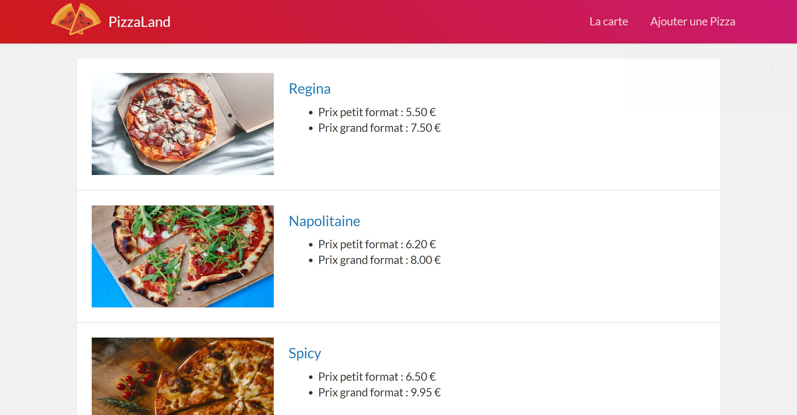

# TP 2 - POO - modules - typage <!-- omit in toc -->

- [A. Préparatifs](#a-préparatifs)
	- [A.1. *Préparatifs :* Installation](#a1-préparatifs--installation)
	- [A.2. *Préparatifs :* Le fichier `package.json`](#a2-préparatifs--le-fichier-packagejson)
	- [A.3. *Préparatifs :* Créer un script de build personnalisé](#a3-préparatifs--créer-un-script-de-build-personnalisé)
- [Étape suivante](#Étape-suivante)

## A. Préparatifs

***Si vous avez terminé le TP précédent, que vous êtes fier de vous, et <u>qu'un professeur a validé votre code et votre installation de Babel</u>, alors vous pouvez repartir de vos propres fichiers. <br>Si <u>une de ces conditions</u> n'est pas remplie, alors vous pouvez récupérer le dossier "demarrage" de ce TP qui contient une solution (commentée) du précédent TP.***

### A.1. *Préparatifs :* Installation
1. **Si vous utilisez le dossier de démarrage fourni dans ce repo (cad. que vous ne repartez pas de vos fichiers du TP précédent), une fois les fichiers récupérés, il faut installer les outils JS néccessaires au bon fonctionnement du projet, notamment le compilateur [Babel](https://babeljs.io).**

	Ouvrez un terminal directement dans Visual Studio Code à l'aide du raccourci <kbd>CTRL</kbd>+<kbd>SHIFT</kbd>+<kbd>*</kbd> (ce terminal intégré utilise le terminal par défaut du système, mais vous pouvez le configurer pour utiliser un autre terminal comme Git bash sous windows par exemple) puis tapez :
	```bash
	cd /chemin/vers/votre/dossier/demarrage
	npm install
	```
	Vous noterez qu'on ne précise pas les paquets à installer, npm va en effet les déterminer automatiquement à partir du contenu du fichier `package.json` et notamment à partir des sections "dependencies" et "devDependencies" qui indiquent quels sont les paquets qui ont été installés précédemment.

2. **Lancez un serveur http dans le dossier de votre TP** :
	```bash
	cd /chemin/vers/votre/dossier/demarrage
	python3 -m http.server 8000
	```
	*Si vous avez des questions sur le lancement de ce serveur, ou comment le faire sur votre propre machine, relisez attentivement le [README du précédent TP](../01-premiers-pas-en-js/README.md#Préparatifs) !*

3. **Vérifiez dans le navigateur que la page index.html fournie s'affiche correctement** en ouvrant l'url http://localhost:8000. Le résultat attendu (si vous aviez fini le TP précédent !) est le suivant : <br><a href="images/pizzaland-00.jpg"></a>

	***NB: Si la page ne s'affiche pas correctement**, vérifiez que vous avez bien lancé python dans le dossier de démarrage, c'est à dire celui où se trouve le fichier `index.html`. Puis vérifiez dans la `Console` ou dans l'onglet `Sources` (Chrome)ou `Debugger` (Firefox) qu'l n'y a pas d'erreur JS.*

4. **Effacez le contenu du fichier `js/main.js`** et ne conservez dedans que la déclaration du tableau `data` contenant les 3 objets littéraux de pizzas :
	```js
	const data = [
		{
			nom: 'Regina',
			base: 'tomate',
			prix_petite: 5.5,
			prix_grande: 7.5
		},
		{
			nom: 'Napolitaine',
			base: 'tomate',
			prix_petite: 6.2,
			prix_grande: 8
		},
		{
			nom: 'Spicy',
			base: 'crème',
			prix_petite: 6.5,
			prix_grande: 9.95
		},
	];
	```

### A.2. *Préparatifs :* Le fichier `package.json`

Lors du précédent TP nous avons créé un fichier `package.json` à la racine du dossier `demarrage` grâce à la commande `npm init`.

Ce fichier sert à plusieurs choses et notamment :
1. **Il permet de conserver l'historique de tous les paquets qui sont installés dans le projet. C'est en quelque sorte l'équivalent du fichier `pom.xml` de maven.** Vérifiez que dans la section `devDependencies` sont bien listés les paquets suivants :
	- @babel/cli
	- @babel/core
	- @babel/preset-env

	À chaque fois qu'on installe un paquet npm, le paquet en question se télécharge dans le dossier `node_modules`, puis le nom du paquet ainsi que sa version sont automatiquement ajoutés dans le fichier `package.json`. Le dossier `node_modules` n'est <u>jamais</u> versionné (c'est en général un dossier relativement volumineux) mais le `package.json` est lui bien versionné car il servira de "recette" pour indiquer aux développeurs qui rejoindraient le projet quels sont les paquets nécessaires.

	En effet, un nouveau développeur n'aurait qu'à exécuter la commande `npm install` (sans préciser de nom de paquet) pour installer automatiquement toutes les dépendances du projet !

2. **Dans ce fichier on va également pouvoir ajouter des "scripts personnalisés" que l'on pourra lancer à l'aide de la commande `npm run xxxxx`.** C'est cette dernière possibilité que l'on va maintenant utiliser pour nous simplifier la vie dans la suite du TP.

### A.3. *Préparatifs :* Créer un script de build personnalisé
Jusque là pour lancer la compilation avec [Babel](https://babeljs.io), nous lancions une des deux commandes suivantes :

```bash
./node_modules/.bin/babel js -d build
```
ou
```bash
./node_modules/.bin/babel js -d build --verbose --watch --source-maps
```

Avec le `package.json` on va créer des "raccourcis" pour lancer ces commandes plus facilement.

1. Dans Visual Studio Code, **ouvrez le fichier `package.json`** en tapant <kbd>CTRL</kbd>+<kbd>P</kbd> puis le nom du fichier ( <kbd>Enter</kbd> pour ouvrir le fichier)
2. **Localisez la section "scripts" du fichier**. Elle doit ressembler à :
	```json
	"scripts": {
		"test": "echo \"Error: no test specified\" && exit 1"
	},
	```
3. **Cette section permet d'indiquer des tâches qui pourront être lancées à l'aide de la commande `npm run <nom-du-script>`.** Par défaut le `package.json` contient une tâche `"test"`. Lancez le script `"test"` en tapant :
	```bash
	npm run test
	```
	Vous verrez la commande `"echo \"Error: no test specified\" && exit 1"` s'exécuter dans le terminal.
	<br>
	`"test"` est donc une sorte d'alias permettant de lancer une commande plus complexe.
4. **Ajoutez dans le `package.json` un nouveau script nommé "build"** qui permettra de lancer la compilation Babel :
	```json
	"scripts": {
-		"test": "echo \"Error: no test specified\" && exit 1"
+		"test": "echo \"Error: no test specified\" && exit 1",
+		"build": "babel js -d build"
	},
	```
	*Vous noterez que le chemin  `./node_modules/.bin/' n'est plus nécessaire !*
5. **Lancez la commande `npm run build` et constatez avec émerveillement que la compilation babel se lance.**

	*Si la compilation ne se lance pas, plusieurs raisons possibles : soit Babel n'est pas correctement installé, soit la section "scripts" n'est pas correctement formatée (pensez qu'il s'agit d'un fichier json, par conséquent l'oubli d'une virgule entre chaque script ou au contraire l'ajout d'une virgule à la fin du dernier script, sont considérés comme des erreurs de syntaxe).*
1. **Ajoutez un nouveau script nommé `"watch"` qui permette de lancer la commande** :
	```bash
	./node_modules/.bin/babel js -d build --verbose --watch --source-maps
	```
	Lancez la commande `npm run watch` et vérifiez que lorsque vous modifiez le fichier `js/main.js`, le fichier `build/main.js` est bien mis à jour.

## Étape suivante
Si la compilation fonctionne, vous pouvez passer à l'étape suivante : [La POO](B-poo.md)