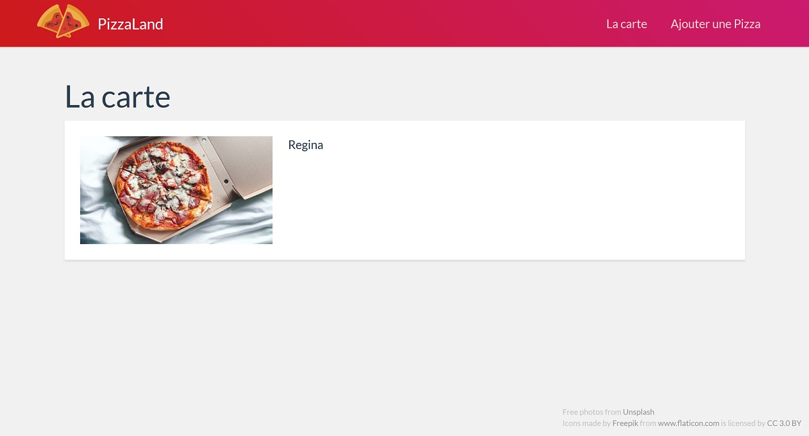

# TP 2 - POO - modules - typage <!-- omit in toc -->

## Sommaire <!-- omit in toc -->
- [B. POO](#b-poo)
	- [B.1. Rappels de syntaxe](#b1-rappels-de-syntaxe)
	- [B.2. Compiler avec Babel](#b2-compiler-avec-babel)
	- [B.3. La classe Component](#b3-la-classe-component)
	- [B.4. *Héritage :* La classe Img](#b4-héritage--la-classe-img)
	- [B.5. *Composition :* La classe PizzaThumbnail](#b5-composition--la-classe-pizzathumbnail)
- [Étape suivante](#Étape-suivante)

## B. POO
***NB* : Dans ce TP vous coderez dans un premier temps vos classes directement dans le fichier `main.js` sans passer par des fichiers (modules) séparés.** Dans la suite du TP on organisera notre code plus proprement en séparant les classes dans des modules différents mais pour le moment on va simplifier la mise en place en remettant ça à plus tard.

### B.1. Rappels de syntaxe
#### B.1.1. class & propriétés publiques
Comme vu dans le cours (*procurez vous le support pdf sur moodle !*) ES6 a introduit une nouvelle syntaxe pour la création de classes. Finis les `prototypes`, désormais le mot clé `class` fait son apparition et permet une d'utiliser syntaxe plus proche de ce qui se fait dans les autres langages objets :
```js
class Animal {
	constructor( name ){
		this.name = name;
	}
}
const threeEyedRaven = new Animal( 'Bran' );
```
La création de propriétés d'instances se fait par l'utilisation du mot clé `this` dans le constructeur : `this.name = name;` permet de créer une propriété `name` sur l'instance en cours de création et de lui assigner la valeur passée au constructeur via l'instruction `new Animal( 'Bran' );`.

On peut ensuite accéder aux propriétés de l'objet en utilisant la notation pointée :
```js
console.log( threeEyedRaven.name );
```
Il est possible également de déclarer les propriétés d'instance en dehors du constructeur de cette manière :
```js
class Animal {
	name;
	constructor( name ){
		this.name = name;
	}
}
```
Attention cependant, cette notation n'est pas encore dans la spec officielle d'EcmaScript (la spec suivie par JavaScript) mais a des chances d'être intégrée dans la version 2019 d'EcmaScript (ES10) : cf. https://github.com/tc39/proposal-class-fields et https://tc39.github.io/proposal-class-fields/

Pour pouvoir l'utiliser, il faudra modifier légèrement la configuration de Babel (cf. chapitre suivant).

#### B.1.2. méthodes
La création de méthodes d'une classe se fait de la manière suivante :
```js
class Animal {
	constructor( name ){
		this.name = name;
	}
	fly() { // déclaration de méthode
		console.log(`${this.name} is flying !`);
	}
}
const threeEyedRaven = new Animal( 'Bran' );
```
Pour appeler la méthode, on utilise simplement la notation pointée :
```js
threeEyedRaven.fly();
```


### B.2. Compiler avec Babel
Comme vu dans le [chapitre précédent](#B.1.1.-class-&-propriétés-publiques), certaines syntaxes que nous allons utiliser dans le TP ne sont pas encore dans la spec officielle (c'est le cas pour la déclaration de propriétés d'instance en dehors du constructeur, les propriétés ou méthodes privées ou encore les propriétés et méthodes statiques).

Ces fonctionnalités du langages sont dans un stade relativement avancé de discussion (niveau 3 sur 4) et ont désormais de grandes chances d'arriver dans la spécification officielle prochainement. Pas de raison de s'en priver donc.

Pour pouvoir utiliser ces syntaxes, nous allons modifier la configuration de Babel qui par défaut n'est capable de compiler que les syntaxes officielles :
1. **Dans le dossier `demarrage`, installez le paquet npm ["@babel/plugin-proposal-class-properties"](https://babeljs.io/docs/en/babel-plugin-proposal-class-properties)** :
	```bash
	npm install --save-dev @babel/plugin-proposal-class-properties
	```
2. Modifiez le fichier `.babelrc` pour y ajouter le plugin que l'on vient d'installer :
	```json
	{
		"presets": ["@babel/env"],
		"plugins": ["@babel/plugin-proposal-class-properties"]
	}
	```
3. **Relancez la compilation à l'aide de la commande `npm run watch` et vérifiez qu'aucune erreur n'est remontée dans le terminal.**

4. **Codez la classe `Animal` dans le fichier main.js** et vérifiez que la syntaxe employée pour la déclaration de la propriété `name` est correctement prise en compte par le compilateur et que la ligne `threeEyedRaven.fly()` affiche bien le message `Bran is flying !` dans la console.

	***Si c'est bon, vous êtes prêt pour la suite !***

### B.3. La classe Component
1. **Créez une classe `Component` ayant les caractéristiques suivantes** :
	+ **le constructeur** prend en paramètre
		- une chaîne nommée `tag`
		- une chaîne nommé `children`

		Ces deux paramètres sont pour le moment simplement sauvegardés dans des propriétés de l'instance: `this.tag` et `this.children`.
	+ **la classe dispose d'une méthode `render()`**. Cette méthode retourne une chaîne de caractères au format html qui correspond à une balise du type de l'attribut `tag` passé au constructeur.

		Par exemple si `tag` vaut `'div'` alors `render()` retournera la chaîne de caractères :
		```js
		'<div></div>'
		```

		Si le paramètre `children` n'est pas vide, le contenu retourné entre les balises ouvrantes et fermantes correspond à la chaîne contenue dans `children`. Par exemple : si `tag` vaut `'div'` et que `children` vaut `'youpi ça marche'` alors `render()` retournera la chaîne :
		```js
		`<div>
			youpi ça marche
		</div>`
		```

		**NB:***Utilisez les template strings pour cette méthode (cf. cours numéro 1) et pensez à passer des lignes dans la chaîne de caractères pour rendre votre code plus lisible.*

2. **Pour tester le bon fonctionnement de la classe, instanciez un Component de type `h1`** avec comme `children` la chaîne `'La carte'`. Puis afficher le résultat de l'appel à la méthode `render()` de cette instance dans la balise de classe CSS `'pageTitle'` :
	```js
	const title = new Component( 'h1', 'La carte' );
	document.querySelector('.pageTitle').innerHTML = title.render();
	```
	Utilisez l'inspecteur d'éléments des devtools du navigateur (clic-droit > inspecter) pour contrôler que le résultat est bien celui attendu, puis contrôlez visuellement que le rendu est bien conforme à la capture suivante : <br><a href="images/pizzaland-01.jpg"></a>

3. **Modifiez le fonctionnement de la méthode render pour prendre en compte le cas où `children` est vide** (`null` ou `undefined`). Par exemple si je crée un Component de ce style :
	```js
	const img = new Component( 'img' );
	```
	`render()` doit retourner un code du type :
	```html
	
	```
	et pas
	```html
	</img>
	```
	(car ce n'est pas un code HTML valide selon la spec du W3C)

4. **Testez à nouveau la classe Component en instanciant cette fois un nouveau Component de type img** :
	```js
	const img = new Component( 'img' );
	document.querySelector( '.pizzasContainer' ).innerHTML = img.render();
	```
	Le résultat obtenu doit être le suivant (notez qu'aucune image ne s'affiche -on a juste un rectangle blanc- car on n'a pas précisé ni de source ni de taille à l'image !): <br><a href="images/pizzaland-02.jpg"></a>

5. **Ajoutez un paramètre `attribute` en 2e position du constructeur de la classe `Component`  : enregistrer ce paramètre dans une propriété d'instance `this.attribute`.** La signature du constructeur sera désormais :
	```js
	constructor( tagName, attribute, children ) {
	```
6. **Modifiez la méthode `render()` pour prendre en compte le paramètre `attribute`**. On considère que ce paramètre aura toujours la forme d'un objet littéral avec deux propriétés : `name` et `value`. Si le paramètre `attribute` a été fourni au constructeur comme ceci :
	```js
	const img = new Component( 'img', null, {name:'src', value:'images/regina.jpg'} );
	```
	`render()` doit retourner un code du type :
	```html
	
	```
	Pour ne pas alourdir trop le code de la méthode render() on va passer par une méthode `renderAttribute()` -appelée dans la méthode `render()`- qui va être en charge du rendu de l'attribut html.

	Testez ce nouveau code, le rendu devra cette fois être :<br><a href="images/pizzaland-03.jpg"></a>
### B.4. *Héritage :* La classe Img
1. **Créez maintenant une nouvelle classe `Img`** qui hérite de `Component` et dont le constructeur s'utilise comme ceci :
	```js
	const img = new Img('images/regina.jpg');
	```
	Testez le résultat de ce composant à l'aide de l'instruction :
	```js
	document.querySelector( '.pizzasContainer' ).innerHTML = img.render();
	```
	Le rendu doit être identique à la capture précédente : <br><a href="images/pizzaland-03.jpg"></a>

### B.5. *Composition :* La classe PizzaThumbnail
1. **Modifiez le code de la méthode render pour permettre à la classe Component de recevoir dans le paramètre `children` un tableau de chaînes de caractères.** <br>Par exemple : si `tag` vaut `"div"` et que `children` vaut `[ "youpi", "ça", "marche" ]` alors `render()` retournera la chaîne `"<div>youpiçamarche</div>"`.

	Pour ne pas alourdir trop le code de la méthode render() et pour avoir un code plus lisible, passez le code de rendu des enfants, dans une méthode `renderChildren()`.

	Pour tester si `children` est un tableau (classe `Array`), vous pouvez utiliser l'opérateur `instanceof` cf. https://developer.mozilla.org/en-US/docs/Web/JavaScript/Reference/Operators/instanceof

	Testez votre classe avec le code suivant :
	```js
	const title = new Component( 'h1', ['La', ' ', 'carte'] );
	document.querySelector('.pageTitle').innerHTML = title.render();
	```

2. **Adaptez la méthode `render()` pour permettre de passer dans `children` non seulement des chaînes de caractères comme c'est déjà le cas mais aussi *d'autres `Component`*, comme ceci** :
	```js
	const c = new Component( 'span', null, [
		new Component( 'img', null, ['FTW'] )
		'JS',
	] );
	```
	La méthode `renderChildren()` devra maintenant tester pour chaque enfant :
	- si cet enfant est lui même une instance de Component, elle fait alors appel à la méthode `render()` du Component enfant (récursivité)
	- si l'enfant est une chaîne de caractères, la chaîne est ajoutée telle qu'elle, comme auparavant

	Pour tester si un enfant est de la classe `Component`, vous pouvez là aussi utiliser l'opérateur `instanceof` cf. https://developer.mozilla.org/en-US/docs/Web/JavaScript/Reference/Operators/instanceof

	Si votre code fonctionne correctement, le code suivant :
	```js
	const c = new Component( 'article', {name:'class', value:'media'}, [
		new Img('images/regina.jpg'),
		'Regina'
	]);
	document.querySelector( '.pizzasContainer' ).innerHTML = c.render();
	```
	doit afficher la page suivante :<br><a href="images/pizzaland-04.jpg"></a>

3. **Créez une classe `PizzaThumbnail`** qui hérite de la classe `Component` :
	+ le constructeur prend en paramètre un objet nommé `pizza` dont le format correspond à celui d'un élément du tableau `data` (cad. propriétés `nom`, `base`, `prix_petite`, `prix_grande`)
	+ la méthode `render()` retourne un code du type :
	```html
	<article class="media">
		<a href="images/regina.jpg">
			
			<section class="infos">
				<h4>Regina</h4>
				<ul>
					<li>Prix petit format : 5.50 €</li>
					<li>Prix grand format : 7.50 €</li>
				</ul>
			</section>
		</a>
	</article>
	```
	+ la classe `PizzaThumbnail` devra utiliser la classe `Img` pour le rendu de l'image de la pizza.

4. **Créez enfin une classe `HomePage` qui hérite de `Component`** :
	-  le constructeur recevra en paramètre le tableau `data`
	-  Pour chaque cellule du tableau `data`, le composant `HomePage` créera un composant `PizzaThumbnail` associé.
	-  le code HTML retourné par la méthode `render()` sera une balise `<section>` dans laquelle sera affichée la combinaison du `render()` de chaque `PizzaThumbnail` contenu dans la page.

	***NB:** en théorie, un simple override du constructor et l'utilisation de la méthode [Array.map](https://developer.mozilla.org/fr/docs/Web/JavaScript/Reference/Objets_globaux/Array/map) doivent suffire !*

	Le résultat attendu est le suivant :<br><a href="images/pizzaland-05.jpg"></a>


## Étape suivante
Si vous avez terminé cette partie sur la POO, il est l'heure de mettre en place les modules dans la partie suivante : [Les modules](C-modules.md).