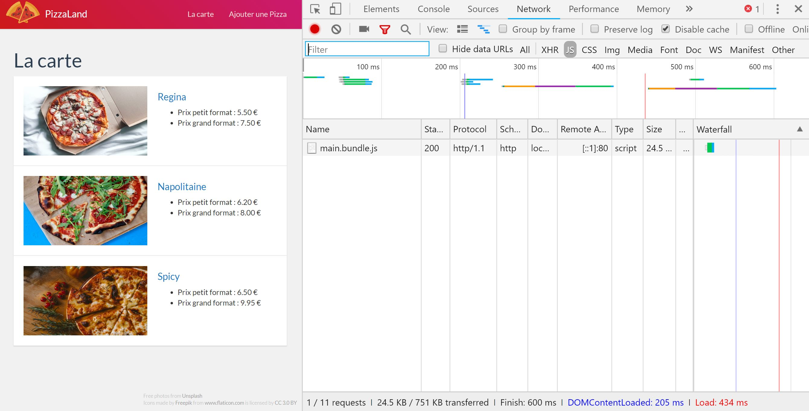

#### TP3 - API DOM <!-- omit in toc -->
# A. Rappels modules & typage <!-- omit in toc -->

## Sommaire <!-- omit in toc -->
- [A.1. Les modules](#a1-les-modules)
	- [A.1.1. Rappels du cours](#a11-rappels-du-cours)
	- [A.1.2. Installation](#a12-installation)
	- [A.1.3. Exercice](#a13-exercice)
- [A.2. Le typage](#a2-le-typage)
	- [A.2.1. Installation](#a21-installation)
	- [A.2.2. Premiers tests](#a22-premiers-tests)
	- [A.2.3. Exercice](#a23-exercice)
- [D.4. Intégration dans Visual Studio Code](#d4-intégration-dans-visual-studio-code)

***Cette partie est destiné à ceux qui n'auraient pas terminé le précédent TP et notamment les parties "modules" et "typage".***

Si vous n'avez fini ni la partie [C. Modules](../02-poo-modules-typage/C-modules.md) ni la partie [D. Typage](../02-poo-modules-typage/D-typage.md) alors commencez par la partie [A.1. Les modules](#a1-les-modules).

Si vous aviez terminé la partie [C. Modules](../../../02-poo-modules-typage/C-modules.md) mais pas eu le temps de finir l'exercice [D. Typage](../02-poo-modules-typage/D-typage.md) alors vous pouvez aller directement à la partie [A.2. Le typage](#a2-le-typage)

Enfin si vous aviez réussi à terminer ces deux exercices du précédent TP, félicitations, vous pouvez ignorer ces rappels et passer directement à l'exercice [B. Les bases](./B-les-bases.md).

## A.1. Les modules

### A.1.1. Rappels du cours
**Comme vu en cours, le système de modules ES6 permet de répartir son code dans plusieurs fichiers et de gérer les dépendances de l'application fichier par fichier plutôt que d'avoir à maintenir une liste exhaustive des scripts à charger dans le fichier html.**

Pour rappel, le système de modules s'utilise grâce à des instructions `import` et `export` :

`./hodor.js` *(module)* :
```javascript
const character = 'Hodor';
export default character;
```
`./main.js` :
```javascript
import character from './hodor.js'; // import de l'export par défaut
console.log( character ); // 'Hodor'
```

Le [support navigateur des modules ES6](https://caniuse.com/#feat=es6-module) est plutôt bon (les dernières versions de Chromium/Chrome et FireFox supportent nativement les modules ES6 (cf. [exercice C.1 du TP précédent](../02-poo-modules-typage/C-modules.md#c1-le-support-natif-des-modules-dans-les-navigateurs-modernes)) mais **pas encore suffisant pour des applications grand public** (absence de support sur IE et android 4.4).

**Pour rendre nos modules compatibles avec les anciens navigateurs, il faut donc utiliser un "bundler".** Cet outil va permettre d'*"assembler"* en un seul fichier toutes les dépendances (tous les scripts JS) de notre application. Le navigateur n'a alors qu'un seul fichier à charger et plus à se soucier des modules.

Comme vu en cours n°2, le bundler le plus employé en JS est [Webpack](https://webpack.js.org/), c'est cet outil que l'on va utiliser.

### A.1.2. Installation
1. **Récupérez le contenu du dossier `demarrage-modules`, il contient une solution du TP sur la POO qui servira de base pour ce TP sur les modules.** Comme lors du TP précédent n'oubliez pas de lancer un serveur web dans ce dossier
	```bash
	cd /chemin/vers/votre/dossier/demarrage-modules
	python3 -m http.server 8000
	```
	*Si vous avez des questions sur le lancement de ce serveur, ou comment le faire sur votre propre machine, relisez attentivement le [README du premier TP](../01-premiers-pas-en-js/README.md#Préparatifs) !*

2. **Ouvrez le fichier `package.json` et constatez que webpack est listé dans les dépendances du projet (comme Babel).** Le dossier `demarrage-modules` est en effet **déjà configuré pour l'utilisation de webpack et Babel**. On va donc pouvoir installer facilement tous les outils nécessaires (dont webpack) grâce à la commande :
	```bash
	npm install
	```
	(à lancer à la racine du dossier de votre projet, cad là où se trouve le fichier `package.json`)

	*Si vous voulez en savoir plus sur le détail de l'installation et de la configuration de webpack vous pouvez consulter [l'exercice C.2. tu TP précédent](../02-poo-modules-typage/C-modules.md#c2-rendre-les-modules-compatibles-avec-les-vieux-navigateurs).*
### A.1.3. Exercice
3. **Créez votre premier module :** Créez un fichier `data.js` dans lequel vous allez déplacer la définition de la constante `data` (qui était jusque là dans le fichier `main.js`) :
	```js
	const data =  [
	  // ici la liste des pizzas
	];
	```
	Toujours dans `data.js` il faut ensuite exporter la constante pour la rendre disponible auprès du reste de l'application :
	```js
	export default data;
	```
	Enfin dans le fichier `main.js` il ne reste plus qu'à importer la constante :
	```js
	import data from './data.js';
	```

	Compilez maintenant l'application à l'aide de la commande `npm run watch`. Si tout s'est bien passé :
	- le terminal dans lequel vous avez lancé la compilation doit afficher une sortie du type :
		<div style="color:red;background:yellow">CAPTURE d'écran compilation</div>
	- que la page continue de s'afficher correctement dans le navigateur et que c'est bien le fichier `build/app.bundle.js` qui est chargé (*via l'onglet Network/Réseau des devtools du navigateur*): <br><a href="images/pizzaland-07-modules-webpack.jpg"></a>
3. **Convertissez maintenant les différentes classes du projet en modules** : passez les classes `Component`, `Img`, `PizzaThumbnail`, et `HomePage` dans des modules ES6 distincts (un module -donc un fichier- par classe).

	Le fichier `main.js` conservera uniquement :
    - l'instanciation et l'affichage (`render()`) du composant `title`
    - l'instanciation et l'affichage (`render()`) de la `homePage`

	Pensez à vérifier régulièrement que la commande `npm run watch` que vous avez lancée au point n°2 ne retourne pas d'erreur et que la page continue de s'afficher correctement dans le navigateur !


## A.2. Le typage

Pour typer statiquement notre code JS (*càd. assigner un type fixe à une variable au moment de sa déclaration*) nous allons utiliser [Flow](https://flow.org/).

***NB:** Si vous venez de terminer le précédent exercice ([A.1. Les modules](#a1-les-modules)) vous pouvez passer directement à la partie [A.2.3. Exercice](#a23-exercice).*

### A.2.1. Installation
1. **Récupérez le contenu du dossier `demarrage-typage`, il contient une solution du TP précédent sur les modules qui servira de base pour ce TP sur le typage.** Comme lors du TP précédent n'oubliez pas de lancer un serveur web dans ce dossier
	```bash
	cd /chemin/vers/votre/dossier/demarrage-typage
	python3 -m http.server 8000
	```
	*Si vous avez des questions sur le lancement de ce serveur, ou comment le faire sur votre propre machine, relisez attentivement le [README du premier TP](../01-premiers-pas-en-js/README.md#Préparatifs) !*

2. **Ouvrez le fichier `package.json` et constatez que flow est listé dans les dépendances du projet (comme webpack et Babel).** Le dossier `demarrage-typage` est en effet **déjà configuré pour l'utilisation de Flow, webpack et Babel**. On va donc pouvoir installer facilement tous les outils nécessaires (dont flow) grâce à la commande :
	```bash
	npm install
	```
	(à lancer à la racine du dossier de votre projet, cad là où se trouve le fichier `package.json`)

	*Si vous voulez en savoir plus sur le détail de l'installation et de la configuration de Flow vous pouvez consulter [l'exercice D.1. du TP précédent](../02-poo-modules-typage/D-typage.md#d1-installation-et-configuration)*

### A.2.2. Premiers tests
1. **Dans le fichier `js/main.js` ajoutez le commentaire suivant (au début du fichier) qui permet d'indiquer à Flow que ce fichier contient des informations de typage :**
   ```js
   // @flow
   ```
2. **Lancez la vérification du code avec flow :**
	```bash
	./node_modules/.bin/flow
	```
	2 erreurs doivent apparaître dans votre terminal :
	<br><div style="background:yellow">REFAIRE CAPTURE D'ECRAN</div>

	Ces deux erreurs nous montrent  en quoi le typage des variables peut nous aider à avoir un code plus robuste... En effet l'erreur est la suivante :

	```
	Cannot assign title.render() to document.querySelector(...).innerHTML
	because property innerHTML is missing in null [1].
	```
	Ce que nous dit cette ligne, c'est que la méthode `document.querySelector()` peut dans certains cas nous retourner une valeur vide (`null`). C'est en effet le cas par exemple si la page html ne contient pas de balise avec la classe CSS 'pageTitle', ou si le script s'exécute avant que la page ne soit complètement chargée.

	Si on laisse notre code tel quel, alors on s'expose à des bugs car dans l'hypothèse où querySelector retournerait `null`, la ligne
	```js
	document.querySelector('.pageTitle').innerHTML = title.render();
	```
	planterait aussitôt (*impossible d'appeler la propriété "innerHTML" sur une valeur nulle !*) et l'ensemble du code JS qui suit serait ignoré (*dès qu'une erreur JS est lancée, tout le reste du code cesse de s'exécuter*).

3. **Corrigez les deux erreurs remontées par Flow en décomposant les instructions `querySelector` et `innerHTML` en 2 étapes** :
	```js
	const titleElement:?HTMLElement = document.querySelector('.pageTitle');
	if ( titleElement ) {
		titleElement.innerHTML = title.render();
	}
	```

	Vous noterez qu'on en a profité pour typer la nouvelle constante `titleElement` dans un type compatible avec la valeur de retour de querySelector : `:?HTMLElement` permet de préciser que la variable peut soit contenir un `HTMLElement` soit `null` (`?`).

	Faites de même pour la homePage et relancez flow :
	```bash
	./node_modules/.bin/flow
	```
	**vous n'avez en principe plus d'erreur !**

### A.2.3. Exercice
**Maintenant que l'on a réglé les bugs potentiels de notre code, on peut ajouter les informations de typage aux différents fichiers de notre application.**

1. A l'aide du support PDF du cours (disponible sur moodle) et de [la documentation de Flow](https://flow.org/en/docs/types/), Typez le module `Component` :
	- typer toutes les variables (let, const)
	- typer les propriétés d'instances
	- typer les paramètres de méthodes et de fonctions
	- typer les valeurs de retour des méthodes et fonctions

	***NB:** Ne pas oublier d'ajouter le commentaire `// @flow` en entête de chaque fichier modifié*

	***NB2:** Pour typer une variable ou un paramètre de méthode qui reçoit un objet littéral (comme par exemple le paramètre attribute), la notation est la suivante :*

	```js
	const o:{name:string, age:number} = {
		name:'Bran',
		age:17
	}
	```

	*Plus d'informations sur le typage d'objets littéraux ici : https://flow.org/en/docs/types/objects/*


2. **Une fois la classe Component typée, vérifiez une nouvelle fois que votre code est exempt d'erreurs de typage** en lançant la commande `./node_modules/.bin/flow`

3. **Enfin, recompilez votre code JS** avec la commande `npm run build` ou `npm run watch`, si la page continue de s'afficher correctement dans le navigateur, alors vous pouvez passer à [l'exercice suivant](./B-les-bases.md).

<div style="color:red">

## D.4. Intégration dans Visual Studio Code

Pour permettre à Visual Studio Code de comprendre les informations de typage flow, installez l'extension : https://marketplace.visualstudio.com/items?itemName=flowtype.flow-for-vscode

1. Activez l'extension une fois installée en relançant vscode
2. Ouvrez les préférences de vscode (<kbd>CTRL</kbd>+<kbd>SHIFT</kbd>+<kbd>P</kbd> &gt; Préférences : Ouvrir les paramètres <u>d'espace de travail</u>)
3. recherchez la clé "Javascript › Validate: Enable" et décochez la case pour désactiver le système de vérification du JS intégré à VSCode
4. recherchez la clé "Flow : Use NPMPackaged Flow" et cochez la case pour permettre à l'extension d'utiliser la version de flow qui est installée dans le projet.
5. Vérifiez que le dossier que vous avez ouvert dans VSCode correspond bien au dossier "demarrage" : à la racine du dossier, dans l'explorateur de VSCode, vous devez trouver le dossier `node_modules`

Désormais si vos fichiers comportent l'annotation `// @flow` alors le plugin va afficher les éventuelles erreurs de typage !

</div>