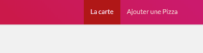

#### TP3 - API DOM <!-- omit in toc -->
# B. Les événements de l'API DOM <!-- omit in toc -->

## Sommaire <!-- omit in toc -->
- [B.1. Rappels](#b1-rappels)
- [B.2. La gestion du menu](#b2-la-gestion-du-menu)
- [Étape suivante](#Étape-suivante)


## B.1. Rappels
**Le système d'événements en JS permet de réagir à des actions de l'utilisateur (survol d'un élément, click sur un lien, soumission d'un formulaire, etc.) ou à des événements déclenchés par le navigateur (fin du chargement de la page ou d'une image, etc.).**

Comme vu en cours (cf. pdf du cours sur moodle) on peut associer une fonction à un événement grâce à la méthode `addEventListener()` de la classe Element.

Par exemple, pour déclencher la fonction `handleClick` lors du clic sur le premier lien de la page, on peut écrire :
```JavaScript
const link:?HTMLElement = document.querySelector('a');
function handleClick( event:Event ) {
	event.preventDefault();
	console.log(event);
}
if ( link ){
	link.addEventListener('click', handleClick);
}
```

Notez que comme vu en cours :
1. le 2e paramètre que l'on passe à addEventListener est une référence vers la fonction `handleClick` et pas l'exécution de la fonction (`handleClick()`)
2. la fonction qui est passée à `addEventListener()` recevra un objet de la classe [`Event`](https://developer.mozilla.org/en-US/docs/Web/API/Event)
3. Il faut presque systématiquement (sauf cas  particuliers) appeler en premier lieu la méthode `event.preventDefault()` qui permet d'éviter que le navigateur n'exécute le traitement par défaut de l'événement : par exemple rediriger l'utilisateur vers une nouvelle page lorsqu'il clique sur un lien, recharger la page lorsqu'il soumet un formulaire, etc.

## B.2. La gestion du menu
Dans le fichier `main.js`
1. **Commencez par commenter le code de l'exercice [A. Les bases de l'API DOM](./A-les-bases.md)** (certains sélecteurs pourront vous être utiles par la suite)
2. A l'aide de `querySelector()` et `addEventListener()`, **affichez un message dans la console à chaque fois que l'utilisateur clique sur le lien du menu de navigation "Ajouter une pizza"**
3. **Effacez le code précédent et remplacez le par un code qui permette d'écouter le clic sur *tous* les liens du menu de navigation** :

	Au clic sur n'importe quel lien de la navigation (actuellement il n'y a dans le menu que les liens "La carte" et "Ajouter une pizza", mais ce code doit fonctionner quelque soit le nombre de liens dans le menu) afficher dans la console le libellé du lien qui a été cliqué grâce à `event.currentTarget` (type `EventTarget`) et `element.innerHTML` : par exemple si l'utilisateur clique sur le lien "La carte" on affiche dans le console la chaîne de caractères `"La carte"`

	***NB :** Pour information, le type de `event.currentTarget` est `EventTarget` et celui de la valeur retournée par la méthode `querySelectorAll()` est `NodeList<HTMLElement>`*
4. **Ajoutez la classe CSS "active" sur la balise `<li>` qui contient le lien qui a été cliqué** (utilisez pour cela la propriété [element.parentElement](https://developer.mozilla.org/en-US/docs/Web/API/Node/parentElement))
5. **Juste avant d'ajouter la classe "active" sur le lien cliqué, effacez les classes CSS du `<li>` du menu qui était précédemment actif** de manière à n'avoir qu'un seul lien actif à la fois<br>

## Étape suivante
Maintenant que l'on est capable de détecter les actions de l'utilisateur nous allons travailler sur la gestion des formulaires dans le prochain exercice : [C. Les formulaires](./C-formulaires.md).