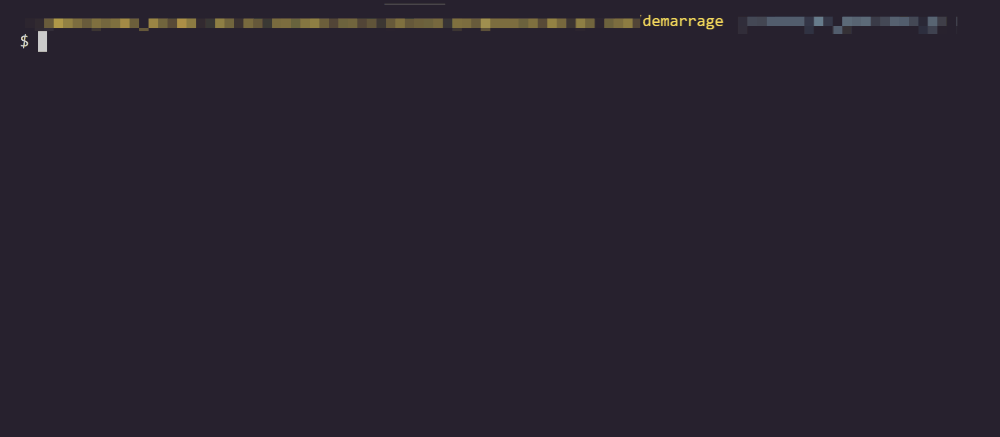
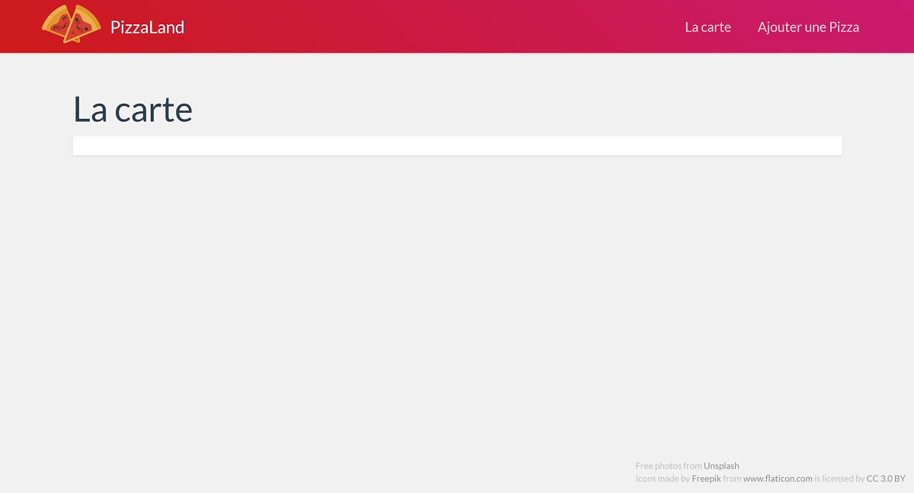
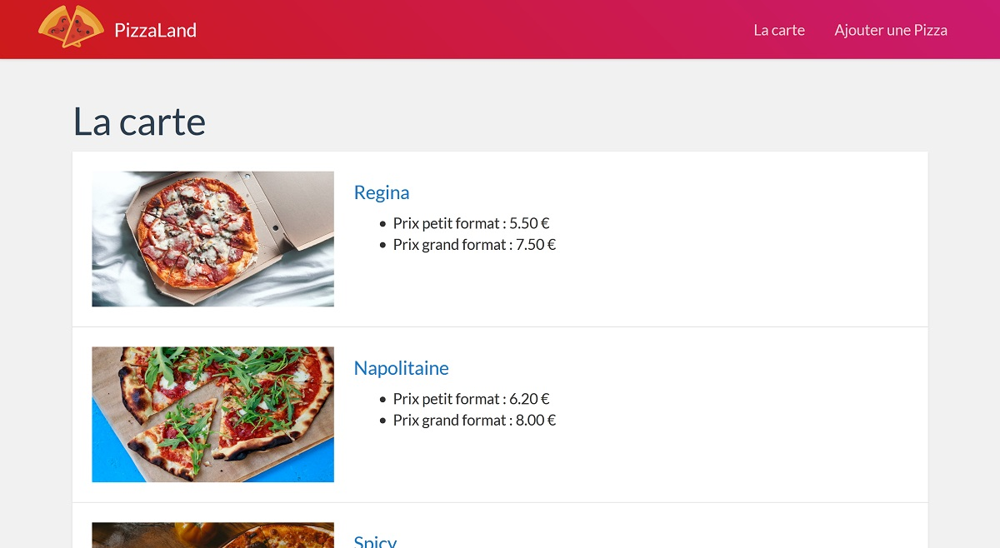
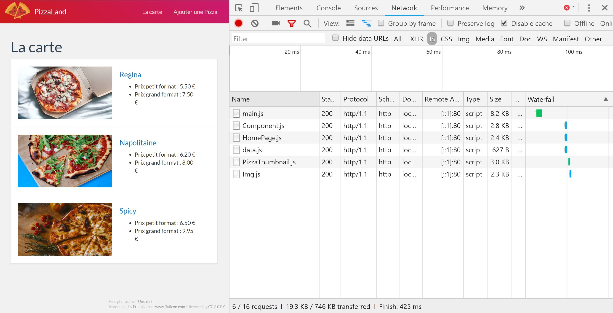
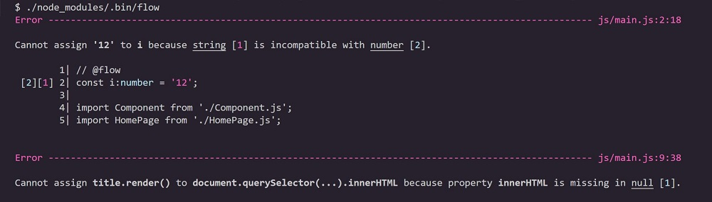

# TP 2 - POO - modules - typage <!-- omit in toc -->

## Objectifs <!-- omit in toc -->
- Savoir faire de la POO en ES6
- Mettre en oeuvre le système de modules
- Ajouter le support du typage statique à notre application
- Et faire évoluer notre application ***"Pizzaland"*** 🍕

## Sommaire <!-- omit in toc -->
- [Préparatifs](#préparatifs)
	- [*Préparatifs :* Installation](#préparatifs--installation)
	- [*Préparatifs :* scripts de compilation](#préparatifs--scripts-de-compilation)
- [A. POO](#a-poo)
	- [A.1. Rappels de syntaxe](#a1-rappels-de-syntaxe)
	- [A.2. Compiler avec Babel](#a2-compiler-avec-babel)
	- [A.3. La classe Component](#a3-la-classe-component)
	- [A.4. *Héritage :* La classe Img](#a4-héritage--la-classe-img)
	- [A.5. *Composition :* La classe PizzaThumbnail](#a5-composition--la-classe-pizzathumbnail)
- [B. Modules](#b-modules)
	- [B.1. Le support des modules dans les navigateurs modernes](#b1-le-support-des-modules-dans-les-navigateurs-modernes)
	- [B.2. Rendre les modules compatibles avec les vieux navigateurs](#b2-rendre-les-modules-compatibles-avec-les-vieux-navigateurs)
- [C. Typage](#c-typage)
	- [C.1 Installation et configuration](#c1-installation-et-configuration)
	- [C.2. Premiers tests](#c2-premiers-tests)
	- [C.3. intégration avec Babel](#c3-intégration-avec-babel)
	- [C.4. Typer notre code](#c4-typer-notre-code)
- [D. Pour aller plus loin](#d-pour-aller-plus-loin)
	- [D.1. *Propriétés et méthodes statiques :* La classe PageRenderer](#d1-propriétés-et-méthodes-statiques--la-classe-pagerenderer)
	- [D.2. La classe AddPizzaPage](#d2-la-classe-addpizzapage)

## Préparatifs

***Si vous avez terminé le TP précédent, que vous êtes fier de vous, et <u>qu'un professeur vous a validé votre code et votre installation de Babel</u>, alors vous pouvez repartir de vos propres fichiers. <br>Si <u>une de ces conditions</u> n'est pas remplie, alors vous pouvez récupérer le dossier "demarrage" de ce TP qui contient une solution (commentée) du précédent TP.***

### *Préparatifs :* Installation
1. **Si vous utilisez le dossier de démarrage fourni dans ce repo (cad. que vous ne repartez pas de vos fichiers du TP précédent), une fois les fichiers récupérés, lancez la commande suivante dans le dossier "demarrage".** Cette commande permet d'installer les outils JS qui ont été utiles au développement du projet lors du précédent TP et notamment le compilateur [Babel](https://babeljs.io).

	Ouvrez un terminal directement dans Visual Studio Code à l'aide du raccourci <kbd>CTRL</kbd>+<kbd>SHIFT</kbd>+<kbd>*</kbd> (ce terminal intégré utilise le terminal par défaut du système, mais vous pouvez le configurer pour utiliser un autre terminal comme Git bash sous windows) puis tapez :
	```bash
	cd /chemin/vers/votre/dossier/demarrage
	npm install
	```
	Vous noterez qu'on ne précise pas les paquets à installer, npm va en effet les déterminer automatiquement à partir du contenu du fichier `package.json` et notamment à partir des sections "dependencies" et "devDependencies" qui indiquent quels sont les paquets qui ont été installés précédemment.

2. **Lancez un serveur http dans le dossier de votre TP** :
	```bash
	cd /chemin/vers/votre/dossier/demarrage
	python3 -m http.server 8000
	```
	*Si vous avez des questions sur le lancement de ce serveur, ou comment le faire sur votre propre machine, relisez attentivement le [README du précédent TP](../01-premiers-pas-en-js/README.md#Préparatifs) !*

3. **Vérifiez dans le navigateur que la page index.html fournie s'affiche correctement** en ouvrant l'url http://localhost:8000. Le résultat attendu (si vous aviez fini le TP précédent !) est le suivant : <br><a href="images/pizzaland-00.jpg"></a>

	***NB: Si la page ne s'affiche pas correctement**, vérifiez que vous avez bien lancé python dans le dossier de démarrage, c'est à dire celui où se trouve le fichier `index.html`. Puis vérifiez dans la `Console` ou dans l'onglet `Sources` (Chrome)ou `Debugger` (Firefox) qu'l n'y a pas d'erreur JS.*

4. **Effacez le contenu du fichier `js/main.js`** et ne conservez dedans que la déclaration du tableau `data` contenant les 3 objets littéraux de pizzas :
	```js
	const data = [
		{
			nom: 'Regina',
			base: 'tomate',
			prix_petite: 5.5,
			prix_grande: 7.5
		},
		{
			nom: 'Napolitaine',
			base: 'tomate',
			prix_petite: 6.2,
			prix_grande: 8
		},
		{
			nom: 'Spicy',
			base: 'crème',
			prix_petite: 6.5,
			prix_grande: 9.95
		},
	];
	```

### *Préparatifs :* scripts de compilation

Lors du précédent TP nous avons créé un fichier `package.json` à la racine du dossier `demarrage` grâce à la commande `npm init`.

#### Utilité du `package.json`
Ce fichier sert à plusieurs choses et notamment :
1. **Il permet de conserver l'historique de tous les paquets qui sont installés dans le projet. C'est en quelque sorte l'équivalent du fichier `pom.xml` de maven.** Vérifiez que dans la section `devDependencies` sont bien listés les paquets suivants :
	- @babel/cli
	- @babel/core
	- @babel/preset-env

	À chaque fois qu'on installe un paquet npm, le paquet en question se télécharge dans le dossier `node_modules` et le nom du paquet ainsi que sa version sont automatiquement ajoutés dans le fichier `package.json`. Le dossier `node_modules` n'est <u>jamais</u> versionné (c'est en général un dossier relativement volumineux) mais le `package.json` est lui bien versionné car il servira de "recette" pour indiquer aux développeurs qui rejoindraient le projet quels sont les paquets qui sont nécessaires au projet.

	En effet, un développeur qui rejoindrait le projet n'aurait qu'à exécuter la commande `npm install` (sans préciser de nom de paquet) pour installer automatiquement toutes les dépendances du projet !

2. **Dans ce fichier on va également pouvoir ajouter des scripts personnalisés que l'on pourra lancer à l'aide de la commande `npm run`.** C'est cette dernière possibilité que l'on va maintenant utiliser pour nous simplifier la vie dans la suite du TP.

#### Créer un script personnalisé
Jusque là pour lancer la compilation avec [Babel](https://babeljs.io), nous lancions une des deux commandes suivantes :

```bash
./node_modules/.bin/babel js -d build
```
ou
```bash
./node_modules/.bin/babel js -d build --verbose --watch --source-maps
```

Avec le `package.json` on va créer des "raccourcis" pour lancer ces commandes plus facilement.

1. Dans Visual Studio Code, **ouvrez le fichier `package.json`** en tapant <kbd>CTRL</kbd>+<kbd>P</kbd> puis le nom du fichier ( <kbd>Enter</kbd> pour ouvrir le fichier)
2. **Localisez la section "scripts" du fichier**. Elle doit ressembler à :
	```json
	"scripts": {
		"test": "echo \"Error: no test specified\" && exit 1"
	},
	```
3. **Cette section permet d'indiquer des tâches qui pourront être lancées à l'aide de la commande `npm run <nom-du-script>`.** Par défaut le `package.json` contient une tâche `"test"`. Lancez le script `"test"` en tapant :
	```bash
	npm run test
	```
	Vous verrez la commande `"echo \"Error: no test specified\" && exit 1"` s'exécuter dans le terminal.
	<br>
	`"test"` est donc une sorte d'alias permettant de lancer une commande plus complexe.
4. **Ajoutez dans le `package.json` un nouveau script nommé "build"** qui permettra de lancer la compilation Babel :
	```json
	"scripts": {
	-	"test": "echo \"Error: no test specified\" && exit 1"
	+	"test": "echo \"Error: no test specified\" && exit 1",
	+	"build": "babel js -d build"
	},
	```
	*Vous noterez que le chemin  `./node_modules/.bin/' n'est plus nécessaire !*
5. **Lancez la commande `npm run build` et constatez avec émerveillement que la compilation babel se lance.**

	*Si la compilation ne se lance pas, plusieurs raisons possibles : soit Babel n'est pas correctement installé, soit la section "scripts" n'est pas correctement formatée (pensez qu'il s'agit d'un fichier json, par conséquent l'oubli d'une virgule entre chaque script ou au contraire l'ajout d'une virgule à la fin du dernier script, sont considérés comme des erreurs de syntaxe).*
1. **Ajoutez un nouveau script nommé `"watch"` qui permette de lancer la commande** :
	```bash
	./node_modules/.bin/babel js -d build --verbose --watch --source-maps
	```
	Lancez la commande `npm run watch` et vérifiez que lorsque vous modifiez le fichier `js/main.js`, le fichier `build/main.js` est bien mis à jour.

## A. POO
***NB* : Dans ce TP vous coderez dans un premier temps vos classes directement dans le fichier `main.js` sans passer par des fichiers (modules) séparés.** Dans la suite du TP on organisera notre code plus proprement en séparant les classes dans des modules différents mais pour le moment on va simplifier la mise en place en remettant ça à plus tard.

### A.1. Rappels de syntaxe
#### A.1.1. class & propriétés publiques
Comme vu dans le cours (*procurez vous le support pdf sur moodle !*) ES6 a introduit une nouvelle syntaxe pour la création de classes. Finis les `prototypes`, désormais le mot clé `class` fait son apparition et permet une d'utiliser syntaxe plus proche de ce qui se fait dans les autres langages objets :
```js
class Animal {
	constructor( name ){
		this.name = name;
	}
}
const threeEyedRaven = new Animal( 'Bran' );
```
La création de propriétés d'instances se fait par l'utilisation du mot clé `this` dans le constructeur : `this.name = name;` permet de créer une propriété `name` sur l'instance en cours de création et de lui assigner la valeur passée au constructeur via l'instruction `new Animal( 'Bran' );`.

On peut ensuite accéder aux propriétés de l'objet en utilisant la notation pointée :
```js
console.log( threeEyedRaven.name );
```
Il est possible également de déclarer les propriétés d'instance en dehors du constructeur de cette manière :
```js
class Animal {
	name;
	constructor( name ){
		this.name = name;
	}
}
```
Attention cependant, cette notation n'est pas encore dans la spec officielle d'EcmaScript (la spec suivie par JavaScript) mais a des chances d'être intégrée dans la version 2019 d'EcmaScript (ES10) : cf. https://github.com/tc39/proposal-class-fields et https://tc39.github.io/proposal-class-fields/

Pour pouvoir l'utiliser, il faudra modifier légèrement la configuration de Babel (cf. chapitre suivant).

#### A.1.2. méthodes
La création de méthodes d'une classe se fait de la manière suivante :
```js
class Animal {
	constructor( name ){
		this.name = name;
	}
	fly() { // déclaration de méthode
		console.log(`${this.name} is flying !`);
	}
}
const threeEyedRaven = new Animal( 'Bran' );
```
Pour appeler la méthode, on utilise simplement la notation pointée :
```js
threeEyedRaven.fly();
```


### A.2. Compiler avec Babel
Comme vu dans le [chapitre précédent](#A.1.1.-class-&-propriétés-publiques), certaines syntaxes que nous allons utiliser dans le TP ne sont pas encore dans la spec officielle (c'est le cas pour la déclaration de propriétés d'instance en dehors du constructeur, les propriétés ou méthodes privées ou encore les propriétés et méthodes statiques).

Ces fonctionnalités du langages sont dans un stade relativement avancé de discussion (niveau 3 sur 4) et ont désormais de grandes chances d'arriver dans la spécification officielle prochainement. Pas de raison de s'en priver donc.

Pour pouvoir utiliser ces syntaxes, nous allons modifier la configuration de Babel qui par défaut n'est capable de compiler que les syntaxes officielles :
1. **Dans le dossier `demarrage`, installez le paquet npm ["@babel/plugin-proposal-class-properties"](https://babeljs.io/docs/en/babel-plugin-proposal-class-properties)** :
	```bash
	npm install --save-dev @babel/plugin-proposal-class-properties
	```
2. Modifiez le fichier `.babelrc` pour y ajouter le plugin que l'on vient d'installer :
	```json
	{
	-	"presets": ["@babel/env"]
	+	"presets": ["@babel/env"],
	+	"plugins": ["@babel/plugin-proposal-class-properties"]
	}
	```
3. **Relancez la compilation à l'aide de la commande `npm run watch` et vérifiez qu'aucune erreur n'est remontée dans le terminal.**

4. **Codez la classe `Animal` dans le fichier main.js** et vérifiez que la syntaxe employée pour la déclaration de la propriété `name` est correctement prise en compte par le compilateur et que la ligne `threeEyedRaven.fly()` affiche bien le message `Bran is flying !` dans la console.

	***Si c'est bon, vous êtes prêt pour la suite !***

### A.3. La classe Component
1. **Créez une classe `Component` ayant les caractéristiques suivantes** :
	+ **le constructeur** prend en paramètre
		- une chaîne nommée `tag`
		- une chaîne nommé `children`

		Ces deux paramètres sont pour le moment simplement sauvegardés dans des propriétés de l'instance: `this.tag` et `this.children`.
	+ **la classe dispose d'une méthode `render()`**. Cette méthode retourne une chaîne de caractères au format html qui correspond à une balise du type de l'attribut `tag` passé au constructeur.

		Par exemple si `tag` vaut `'div'` alors `render()` retournera la chaîne de caractères :
		```js
		'<div></div>'
		```

		Si le paramètre `children` n'est pas vide, le contenu retourné entre les balises ouvrantes et fermantes correspond à la chaîne contenue dans `children`. Par exemple : si `tag` vaut `'div'` et que `children` vaut `'youpi ça marche'` alors `render()` retournera la chaîne :
		```js
		`<div>
			youpi ça marche
		</div>`
		```

		***NB:**Utilisez les template strings pour cette méthode (cf. cours numéro 1) et pensez à passer des lignes dans la chaîne de caractères pour rendre votre code plus lisible.*

2. **Pour tester le bon fonctionnement de la classe, instanciez un Component de type `h1`** avec comme `children` la chaîne `'La carte'`. Puis afficher le résultat de l'appel à la méthode `render()` de cette instance dans la balise de classe CSS `'pageTitle'` :
	```js
	const title = new Component( 'h1', 'La carte' );
	document.querySelector('.pageTitle').innerHTML = title.render();
	```
	Utilisez l'inspecteur d'éléments des devtools du navigateur (clic-droit > inspecter) pour contrôler que le résultat est bien celui attendu, puis contrôlez visuellement que le rendu est bien conforme à la capture suivante : <br><a href="images/pizzaland-01.jpg"></a>

3. **Modifiez le fonctionnement de la méthode render pour prendre en compte le cas où `children` est vide** (`null` ou `undefined`). Par exemple si je crée un Component de ce style :
	```js
	const img = new Component( 'img' );
	```
	`render()` doit retourner un code du type :
	```html
	
	```
	et pas
	```html
	</img>
	```
	(car ce n'est pas un code HTML valide selon la spec du W3C)

4. **Testez à nouveau la classe Component en instanciant cette fois un nouveau Component de type img** :
	```js
	const img = new Component( 'img' );
	document.querySelector( '.pizzasContainer' ).innerHTML = img.render();
	```
	Le résultat obtenu doit être le suivant (notez qu'aucune image ne s'affiche -on a juste un rectangle blanc- car on n'a pas précisé ni de source ni de taille à l'image !): <br><a href="images/pizzaland-02.jpg"></a>

5. **Ajoutez un paramètre `attribute` en 2e position du constructeur de la classe `Component`  : enregistrer ce paramètre dans une propriété d'instance `this.attribute`.** La signature du constructeur sera désormais :
	```js
	constructor( tagName, attribute, children ) {
	```
6. **Modifiez la méthode `render()` pour prendre en compte le paramètre `attribute`**. On considère que ce paramètre aura toujours la forme d'un objet littéral avec deux propriétés : `name` et `value`. Si le paramètre `attribute` a été fourni au constructeur comme ceci :
	```js
	const img = new Component( 'img', null, {name:'src', value:'images/regina.jpg'} );
	```
	`render()` doit retourner un code du type :
	```html
	
	```
	Pour ne pas alourdir trop le code de la méthode render() on va passer par une méthode `renderAttribute()` -appelée dans la méthode `render()`- qui va être en charge du rendu de l'attribut html.

	Testez ce nouveau code, le rendu devra cette fois être :<br><a href="images/pizzaland-03.jpg"></a>
### A.4. *Héritage :* La classe Img
1. **Créez maintenant une nouvelle classe `Img`** qui hérite de `Component` et dont le constructeur s'utilise comme ceci :
	```js
	const img = new Img('images/regina.jpg');
	```
	Testez le résultat de ce composant à l'aide de l'instruction :
	```js
	document.querySelector( '.pizzasContainer' ).innerHTML = img.render();
	```
	Le rendu doit être identique à la capture précédente : <br><a href="images/pizzaland-03.jpg"></a>

### A.5. *Composition :* La classe PizzaThumbnail
1. **Modifiez le code de la méthode render pour permettre à la classe Component de recevoir dans le paramètre `children` un tableau de chaînes de caractères.** <br>Par exemple : si `tag` vaut `"div"` et que `children` vaut `[ "youpi", "ça", "marche" ]` alors `render()` retournera la chaîne `"<div>youpiçamarche</div>"`.

	Pour ne pas alourdir trop le code de la méthode render() et pour avoir un code plus lisible, passez le code de rendu des enfants, dans une méthode `renderChildren()`.

	Pour tester si `children` est un tableau (classe `Array`), vous pouvez utiliser l'opérateur `instanceof` cf. https://developer.mozilla.org/en-US/docs/Web/JavaScript/Reference/Operators/instanceof

	Testez votre classe avec le code suivant :
	```js
	const title = new Component( 'h1', ['La', ' ', 'carte'] );
	document.querySelector('.pageTitle').innerHTML = title.render();
	```

2. **Adaptez la méthode `render()` pour permettre de passer dans `children` non seulement des chaînes de caractères comme c'est déjà le cas mais aussi *d'autres `Component`*, comme ceci** :
	```js
	const c = new Component( 'span', null, [
		new Component( 'img', null, ['FTW'] )
		'JS',
	] );
	```
	La méthode `renderChildren()` devra maintenant tester pour chaque enfant :
	- si cet enfant est lui même une instance de Component, elle fait alors appel à la méthode `render()` du Component enfant (récursivité)
	- si l'enfant est une chaîne de caractères, la chaîne est ajoutée telle qu'elle, comme auparavant

	Pour tester si un enfant est de la classe `Component`, vous pouvez là aussi utiliser l'opérateur `instanceof` cf. https://developer.mozilla.org/en-US/docs/Web/JavaScript/Reference/Operators/instanceof

	Si votre code fonctionne correctement, le code suivant :
	```js
	const c = new Component( 'article', {name:'class', value:'media'}, [
		new Img('images/regina.jpg'),
		'Regina'
	]);
	document.querySelector( '.pizzasContainer' ).innerHTML = c.render();
	```
	doit afficher la page suivante :<br><a href="images/pizzaland-04.jpg"></a>

3. **Créez une classe `PizzaThumbnail`** qui hérite de la classe `Component` :
	+ le constructeur prend en paramètre un objet nommé `pizza` dont le format correspond à celui d'un élément du tableau `data` (cad. propriétés `nom`, `base`, `prix_petite`, `prix_grande`)
	+ la méthode `render()` retourne un code du type :
	```html
	<article class="media">
		<a href="images/regina.jpg">
			
			<section class="infos">
				<h4>Regina</h4>
				<ul>
					<li>Prix petit format : 5.50 €</li>
					<li>Prix grand format : 7.50 €</li>
				</ul>
			</section>
		</a>
	</article>
	```
	+ la classe `PizzaThumbnail` devra utiliser la classe `Img` pour le rendu de l'image de la pizza.

4. **Créez enfin une classe `HomePage` qui hérite de `Component`** :
	-  le constructeur recevra en paramètre le tableau `data`
	-  Pour chaque cellule du tableau `data`, le composant `HomePage` créera un composant `PizzaThumbnail` associé.
	-  le code HTML retourné par la méthode `render()` sera une balise `<section>` dans laquelle sera affichée la combinaison du `render()` de chaque `PizzaThumbnail` contenu dans la page.

	***NB:** en théorie, un simple override du constructor et l'utilisation de la méthode [Array.map](https://developer.mozilla.org/fr/docs/Web/JavaScript/Reference/Objets_globaux/Array/map) doivent suffire !*

	Le résultat attendu est le suivant :<br><a href="images/pizzaland-05.jpg"></a>


## B. Modules
Comme vu en cours, le système de modules ES6 permet de répartir son code dans plusieurs fichiers et de gérer les dépendances de l'application fichier par fichier plutôt que d'avoir à maintenir une liste exhaustive des scripts à charger dans le fichier html.

Le [support navigateur des modules ES6](https://caniuse.com/#feat=es6-module) est plutôt bon mais pas encore suffisant pour des applications grand public (absence de support sur IE et android 4.4).

Dans un premier temps nous allons mettre de côté ce problème et nous appuyer sur le fait que les dernières versions de Chromium/Chrome et FireFox supportent nativement les modules ES6. Par la suite nous verrons comment solutionner ce problème de compatibilité avec Webpack.
### B.1. Le support des modules dans les navigateurs modernes
1.  **Avant d'utiliser le système de modules et les instructions `import`/`export`, il faut indiquer au navigateur que notre fichier main.js est lui même un module.** Pour cela, ajouter un attribut `type="module"` dans la balise `<script>` du fichier `index.html` :
	```html
	<script type="module" src="js/main.js"></script>
	```
	Vous notez que l'attribut `"defer"` n'est plus nécessaire car il est implicite pour les modules.
2. **Il faut ensuite configurer Babel.** En effet, par défaut Babel va chercher à compiler toutes les instructions `import`et `export` qu'il trouvera pour les transformer en code compatible ES5 (mais qui nécessite l'emploi de librairies supplémentaires). Ici on veut utiliser le support natif du navigateur pour les modules ES6, par conséquent il faut indiquer à Babel de ne pas compiler les `import`/`export`. Modifiez le fichier `.babelrc` comme suit (notez le tableau dans un tableau !) :
	```json
	"presets": [
	-	"@babel/env"
	+	["@babel/env", {"modules": false}]
	],
	```

3.  **Passez enfin la variable `data` ainsi que les classes `Component`, `Img`, `PizzaThumbnail` et `HomePage` dans des modules ES6 distincts**. Rappelez vous, tout ce qui est défini dans un module (variables, fonctions, classes), n'existe qu'à l'intérieur du module sauf s'il est exporté et importé dans un autre fichier. Le fichier `main.js` conservera uniquement :
    - l'instanciation et l'affichage (`render()`) du composant de titre
    - l'instanciation et l'affichage (`render()`) de la `homePage`

	*NB: Pour rappel exporter une constante sur la même ligne que sa création est interdit :*
	```js
	export default const data = [...];
	```
	*Il faut obligatoirement faire cela en deux étapes :*
	```js
	const data = [...];
	export default data;
	```
	*Cette restriction n'est pas valable pour les fonctions et classes qui n'ont pas ce problème, on peut tout à fait faire :*
	```js
	export default class Component {...}
	```

4. **Compilez votre code et testez la page dans le navigateur** : le résultat doit être identique à celui obtenu précédemment :<br><a href="images/pizzaland-05.jpg"></a>

5. **Ouvrez l'onglet Réseau/Network des devtools, vous devez normalement voir le chargement automatique des différents modules** :<br><a href="images/pizzaland-06-modules.jpg"></a>

### B.2. Rendre les modules compatibles avec les vieux navigateurs

Pour rendre notre application compatible avec le système de modules, il faut utiliser un "bundler". Cet outil va permettre d'assembler automatiquement en un seul fichier toutes les dépendances de notre application. Le navigateur n'a alors qu'un seul fichier à charger et plus à se soucier des modules.

Comme vu en cours, le bundler le plus employé en JS est [Webpack](https://webpack.js.org/).

1. **Dans le fichier `index.html`, retirez l'attribut `type="module"` de la balise script et remettez l'attribut `defer`. Remplacez aussi le nom du fichier `build/main.js` par `build/main.bundle.js`.** C'est en effet une pratique courante de nommer les fichiers de ce type avec le mot "bundle".

2. **Installez webpack** à l'aide de la commande suivante :
	```bash
	npm install --save-dev webpack webpack-cli babel-loader
	```
2. **Créez à la racine du dossier `demarrage`(au même niveau que le `package.json` et le `.babelrc`) un fichier `webpack.config.js`** et placez y le code suivant :
	```js
	const path = require('path');

	module.exports = {
		// Fichier d'entrée
		entry: './js/main.js',
		// Fichier de sortie
		output: {
			path: path.resolve(__dirname, './build'),
			filename: 'main.bundle.js'
		},
		module: {
			rules: [
				{
					test: /\.js$/, // tous les fichiers .js
					exclude: /node_modules/, // sauf le dossier node_modules
					use: { // seront transpilés par babel
						loader: 'babel-loader',
					}
				}
			]
		},
		devtool: 'source-map'
	}
	```

3. **Modifiez les scripts `"build"` et `"watch"` du fichier `package.json` pour replacer babel par webpack** (*notez quand même que babel sera toujours utilisé, mais c'est webpack qui va directement le piloter*):
	```json
	- "build": "babel js -d build",
	+ "build": "webpack --mode=production",
    - "watch": "babel js -d build --verbose --watch --source-maps"
    + "watch": "webpack --mode=development --watch"
	```
4. **Lancez la compilation** à l'aide de la commande `watch`
5. **Enfin, vérifiez dans le navigateur que la page s'affiche toujours** et que dans l'onglet "Réseau"/"Network" vous n'avez maintenant bien plus qu'un seul fichier JS téléchargé par le navigateur : le `build/main.bundle.js`<a href="images/pizzaland-07-modules-webpack.jpg"></a>


## C. Typage
Comme vu en cours, il existe plusieurs solutions pour ajouter du typage statique dans notre code JS.

Celle que nous allons employer aujourd'hui se base sur [Flow](https://flow.org/).

### C.1 Installation et configuration
todo: configuration vscode

1. **Installez Flow (attention, cette commande est bien à lancer dans votre dossier de travail, là où se trouvent les fichiers index.html, package.json, .babelrc, etc.) :**
	```bash
	npm install --save-dev flow-bin
	```

2. **Initialisez flow à l'aide de la commande suivante :**
	```bash
	./node_modules/.bin/flow init
	```
5. **Lancez ensuite la vérification de vos fichiers en lançant :**
	```bash
	./node_modules/.bin/flow
	```
	Vous devriez avoir comme résultat final :
	```bash
	No errors!
	```
	En effet, pour le moment nos fichiers ne contiennent aucune information de typage !

### C.2. Premiers tests
1. **Dans le fichier `js/main.js` ajoutez le code suivant (au début du fichier):**
   ```js
   // @flow
   const i:number = '12';
   ```
2. **Relancez la commande `./node_modules/.bin/flow`.** Cette fois plusieurs erreurs doivent apparaître dans votre terminal :
	<br><a href="images/flow-error.jpg"></a>

	On a en réalité 3 erreurs :
	- la première concerne notre ligne `const i:number = '12';` ce qui est normal puisqu'on a volontairement tenté d'assigner une chaîne de caractères dans une variable typée "number". On peut supprimer cette ligne.
	- Les deux autres erreurs nous amènent à comprendre en quoi le typage des variables peut nous aider à avoir un code plus robuste... En effet l'erreur est la suivante :
		```bash
		Cannot assign title.render() to document.querySelector(...).innerHTML because property innerHTML is missing in null [1].
		```
		Ce que nous apprend cette ligne, c'est que la méthode `document.querySelector()` peut dans certains cas nous retourner une valeur vide (`null`). C'est en effet le cas par exemple si la page html ne contient pas de balise avec la classe CSS 'pageTitle', ou si le script s'exécute avant que la page ne soit complètement chargée.

		Si on laisse notre code tel quel, alors on s'expose à des bugs car dans l'hypothèse où querySelector retournerait `null`, la ligne
		```js
		document.querySelector('.pageTitle').innerHTML = title.render();
		```
		planterait aussitôt (impossible d'appeler la propriété "innerHTML" sur une valeur nulle !).

3. **Corrigez les deux erreurs remontées par Flow en décomposant les instructions `querySelector` et `innerHTML` en 2 étapes** :
	```js
	const titleElement:?HTMLElement = document.querySelector('.pageTitle');
	if ( titleElement ) {
		titleElement.innerHTML = title.render();
	}
	```

	Vous noterez qu'on en a profité pour typer la nouvelle variable titleElement dans un type compatible avec la valeur de retour de querySelector (on approfondira ce sujet lors du prochain cours sur l'API DOM).

	Faites de même pour la homePage et relancez flow, vous n'avez en principe plus d'erreur !

### C.3. intégration avec Babel
Si vous tentez de recompiler votre JS une fois les informations de typage ajoutées, vous verrez que webpack et babel n'arriveront plus à compiler votre code.

En effet, la syntaxe flow ne fait pas partie de la spec officielle d'EcmaScript.

On peut cependant assez facilement rendre tout ça compatible :
1. **Installez le preset babel flow** (qui va permettre à babel de comprendre les instructions de typage de flow) :
	```bash
	npm install --save-dev @babel/preset-flow
	```
2. **Dans le fichier `.babelrc` ajoutez le preset "flow"** :
	```json
	{
		"presets": [
	-		["@babel/env", {"modules": false}]
	+		["@babel/env", {"modules": false}],
	+		"@babel/flow"
		],
		"plugins": ["@babel/plugin-proposal-class-properties"],
	}
	```
3. **Relancez la compilation à l'aide de la commande `npm run build` ou `npm run watch`**, vérifiez que tout compile correctement et que l'affichage dans le navigateur est inchangé.


## Ça y est ! <!-- omit in toc -->
***vous avez un environnement de travail prêt à utiliser les dernières technologies JS : des classes avec une syntaxe moderne, des modules et du typage, tout en conservant une compatibilité avec les vieux navigateurs. La vie est belle !***

***Ceci étant dit le travail n'est pas terminé...***

### C.4. Typer notre code
**Maintenant que flow est installé, ajoutez les informations de typage aux différents fichiers de notre application (main, Component, Img, PizzaThumbnail, HomePage):**
 - typer toutes les variables (let, const)
 - typer les propriétés d'instances
 - typer les paramètres de méthodes et de fonctions
 - typer les valeurs de retour des méthodes et fonctions

 ***NB:** Ne pas oublier d'ajouter le commentaire `// @flow` en entête de chaque fichier modifié*

## D. Pour aller plus loin
Si vous avez terminé les précédents exercices voici qui devrait vous occuper et permettre de gagner du temps pour le prochain TP :
### D.1. *Propriétés et méthodes statiques :* La classe PageRenderer
1. Créez une classe `Page` (dans un module à part, bien entendu !)  :
	- qui hérite de `Component`
	- dont le constructeur reçoit comme paramètres: title (string) et children
	- qui dispose d'une méthode `renderTitle()` qui retourne le titre passé au constructeur entouré d'une balise `<h1>...</h1>`
2. Modifiez la classe `HomePage` pour lui faire hériter de `Page`. Son titre sera `'La carte'`.
3. Créez une classe PageRenderer avec :
	- une propriété statique `titleElement` dont la valeur est `document.querySelector('.pageTitle')`
	- une propriété statique `contentElement` dont la valeur est `document.querySelector( '.pizzasContainer' )`
   - une méthode statique `renderPage( page )` qui affiche dans `titleElement` le résultat de l'appel à la méthode `renderTitle()` et dans contentElement le résultat de l'appel à la méthode `render()` de la page passée en paramètre.
4. Afficher la `HomePage` grâce à la classe `PageRenderer`

***NB:** N'oubliez pas de typer toutes vos nouvelles classes au fur et à mesure (ne pas oublier non plus le commentaire `// @flow`) et de vérifier régulièrement que tout est conforme à l'aide de la commande `./node_modules/.bin/flow`*

### D.2. La classe AddPizzaPage

Sur le modèle de la HomePage créez une class `AddPizzaPage` qui servira de formulaire de création de Pizza.

1. Avant toute chose, les éléments HTML de formulaire nécessitent d'avoir plus d'un attribut html. Par exemple la balise `<input type="number" >` peut également recevoir des attributs `min`, `max` et `step` pour configurer les valeurs possibles du champ. Avec notre classe Component actuelle c'est impossible car on ne peut avoir qu'un seul attribut par balise :
   - remplacez la propriété `attribute` par `attributes` (avec un "s")
   - remplacez la méthode `renderAttribute()` par `renderAttributes()` (avec un "s")
   - modifiez tous les appels au constructeur de component qui envoient des attributs de la manière suivante : au lieu d'envoyer un objet avec des propriétés `name` et `value`, c'est maintenant le nom des clés qui détermineront les noms des attributs html à ajouter. Par exemple au lieu d'avoir :
   ```js
   new Component('a', {name:'href', value:'images/regina.jpg'} );
   ```
   on aura
   ```js
   new Component('a', {href:'images/regina.jpg'} );
   ```
   - modifiez le code de la méthode `renderAttributes()` pour prendre en compte cette nouvelle syntaxe

2. Codez la classe AddPizzaPage qui hérite de `Page` et dont le titre est `"Ajouter une pizza"`.

	Cette page doit contenir :
	- une balise `<form>`
	- un `<input type="text">` pour le nom de la pizza
	- deux `<input type="number">` pour le prix_petite et prix_grande
	- un `<select>` pour la base de la pizza avec deux valeurs possibles : 'tomate' ou 'crème'
	- un `<select multiple>` cette fois pour les ingredients de la pizza.
	- un bouton `<button>Ajouter</button>`

	Le constructeur de la classe prend en paramètre un tableau d'ingrédients de cette manière :
	```js
	const addPizzaPage = new AddPizzaPage([
		{id:1, nom:'Mozarella'},
		{id:2, nom:'Jambon'},
		{id:3, nom:'Champignon'},
		{id:4, nom:'Olives'},
	]);
	```

	L'affichage se fait ensuite grâce au `PageRenderer` :
	```js
	PageRenderer.renderPage(addPizzaPage);
	```
