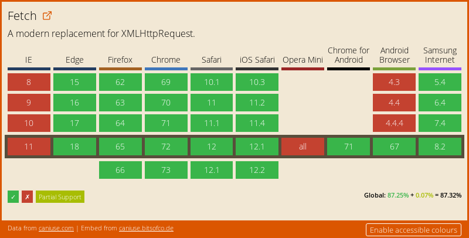

[](#### TP4 - AJAX - jQuery <!-- omit in toc -->
# A. AJAX <!-- omit in toc -->

## Sommaire <!-- omit in toc -->
- [A.1. Installation](#a1-installation)
- [A.2. XMLHttpRequest vs fetch](#a2-xmlhttprequest-vs-fetch)
- [A.3. Charger un fichier statique](#a3-charger-un-fichier-statique)
- [A.4. Appeler une API REST/JSON](#a4-appeler-une-api-restjson)
- [A.5. Envoyer des données à un service distant](#a5-envoyer-des-données-à-un-service-distant)
- [Étape suivante](#Étape-suivante)

***Ce TP va permettre de connecter notre appli JS à une base de données distante par l'intermédiaire d'une API REST/JSON mettre en oeuvre les principales méthodes de sélection et de modification d'éléments de l'arbre DOM.***

## A.1. Installation
1. **Récupérez le contenu du dossier `demarrage`, il contient une solution du TP 3 sur l'API DOM qui servira de base pour ce TP sur AJAX.** Comme lors du TP précédent n'oubliez pas de lancer un serveur web dans ce dossier
	```bash
	cd /chemin/vers/votre/dossier/demarrage
	python3 -m http.server 8000
	```
	*Si vous avez des questions sur le lancement de ce serveur, ou sur la procédure à suivre dans le cas où vous n'utiliseriez pas les postes des salles de TP mais votre propre machine, relisez attentivement le [README du premier TP](../01-premiers-pas-en-js/README.md#Préparatifs) !*

2. **Ouvrez le fichier `package.json` et constatez que Babel, webpack et Flow sont listés dans les dépendances du projet.** Le dossier `demarrage` est en effet **déjà configuré pour l'utilisation de tous les outils nécessaires au dev JS moderne**. On va donc pouvoir tout installer facilement grâce à la commande :
	```bash
	npm install
	```
	(à lancer à la racine du dossier de votre projet, cad là où se trouve le fichier `package.json`)

	*Si vous voulez en savoir plus sur le détail de l'installation et de la configuration des différents outils, vous pouvez consulter les TPs précédents : [modules](../02-poo-modules-typage/C-modules.md#c2-rendre-les-modules-compatibles-avec-les-vieux-navigateurs) et [typage](../02-poo-modules-typage/D-typage.md#d1-installation-et-configuration).*

3. **Une fois tout installé, vous pouvez relancer la compilation à l'aide de la commande `npm run watch`**. Vérifiez ensuite que la page s'affiche correctement dans le navigateur :<br>
	```
	CAPTURE FIN TP API DOM
	```

	Tout au long du TP pensez à vérifier **régulièrement** que les types que vous utilisez pour les variables, paramètres et valeurs de retour des fonctions/méthodes, sont corrects à l'aide de la commande `./node_modules/.bin/flow`

## A.2. XMLHttpRequest vs fetch
Comme vu en cours (*récupérez si ce n'est pas déjà fait le pdf sur moodle !*) il existe deux méthodes pour charger/envoyer des données en JS : [XMLHttpRequest](https://developer.mozilla.org/en-US/docs/Web/API/XMLHttpRequest) et l'[API fetch](https://developer.mozilla.org/en-US/docs/Web/API/Fetch_API/Using_Fetch)

**C'est l'API fetch que nous utiliserons dans ce TP.**
<br>En effet, elle dispose d'une syntaxe plus concise, avec laquelle il est plus facile de chaîner les traitements grâce aux [Promises](https://developer.mozilla.org/fr/docs/Web/JavaScript/Guide/Utiliser_les_promesses).

Pour rappel, le support navigateur de l'API fetch est plutôt bon, mais il reste encode plusieurs points problématiques :

<a href="https://caniuse.com/#feat=fetch"></a>

Comme on peut le voir, **aucune version d'Internet Explorer n'est compatible avec l'API fetch**. C'est aussi le cas des versions d'android 4.4.4 et inférieures. Heureusement, un [polyfill](https://fr.wikipedia.org/wiki/Polyfill) développé par Github est disponible ici : https://github.com/github/fetch. Sur un projet réel il faudrait mettre en place ce polyfill, mais pour gagner du temps nous ignorerons cette problématique dans le TP (ne faites pas ça dans la vraie vie !).


## A.3. Charger un fichier statique
**Avant de connecter notre application au serveur REST/JSON, nos allons nous entraîner sur un fichier statique.**

1. Créez un fichier `news.html` à la racine du dossier `demarrage` avec le code html suivant :
	```html
	<article class="jumbotron">
	  <h1>Welcome to PizzaLand !</h1>
	  <p>
	    Cette semaine découvrez notre nouvelle pizza
	    <strong class="spicy">Spicy</strong>
	    
	    aux délicieuses saveurs épicées !
	  </p>
	</article>
	```
2. Dans le fichier main.js, à la fin du code, lancez le chargement du fichier `news.html` avec l'API fetch :
	```js
	fetch('./news.html');
	```

	Rechargez la page html dans le navigateur et vérifiez dans l'onglet Network/Réseau des devtools que votre page lance bien le chargement du fichier `news.html` :

	```
	CAPTURE DEVTOOLS
	```
	Notez qu'il s'agit bien d'une requête HTTP et pas d'un appel à un fichier local : l'URL de la requête est bien http://localhost:8000/news.html c'est donc bien le serveur HTTP (lancé par Python si vous utilisez les ordis des salles TP) qui génère la réponse HTTP retournée au navigateur.

	Maintenant que l'on arrive à charger le fichier, reste à exploiter les données qu'il contient !
3. Commencez par inspecter la réponse retournée par `fetch()` grâce à la méthode `.then()` :
	```js
	fetch('./news.html')
		.then( (response:Response) => console.log(response) );
	```

	Rechargez la page et regardez ce qui s'affiche dans la console : il s'agit de l'objet de type [Response](https://developer.mozilla.org/en-US/docs/Web/API/Response) retourné par l'API fetch.
	<br>Comme vu en cours, cet objet contient notamment des propriétés `ok`, `status` et `statusText` qui permettent d'en savoir plus sur la réponse HTTP retournée par le serveur.

4. On va maintenant pouvoir récupérer les données brutes contenues dans la réponse HTTP grâce à la méthode [response.text()](https://developer.mozilla.org/en-US/docs/Web/API/Body/text) :
	```js
	fetch('./news.html')
	  .then( (response:Response) => response.text() )
	  .then( (responseText:string) => console.log(responseText) );
	```
	Vérifiez que la console affiche bien le contenu HTML du fichier `news.html` :

	```
	CONSOLE
	```
	*Maintenant que l'on est capable de récupérer le contenu du fichier `news.html` il ne reste plus qu'à **l'injecter dans la page HTML** !*

5. Pour bien comprendre l'ordre d'exécution ajoutons des instructions `console.log()` dans le code précédent comme suit :
	```js
	console.log(1);
	fetch('./news.html')
	  .then( (response:Response) => response.text() )
	  .then( (responseText:string) => console.log(responseText) );
	console.log(2);
	```
    Regardez dans quel ordre s'affichent les log dans la console :
	```
	CONSOLE
	```
	Est-ce que cela vous semble normal ? Non ? C'est pourtant logique : la fonction qui est passée au deuxième `.then()` n'est exécutée qu'une fois que la requête http est terminée (càd. une fois que le fichier est fini de télécharger). Le reste du code continue de s'exécuter en attendant que la requête se termine !

	Si vous avez compris, vous pouvez effacer les `console.log` inutiles et passer à la suite. Sinon appelez le professeur !

1. À l'aide de l'API DOM injectez le contenu du fichier `news.html` dans la section de classe `newsContainer` (cf. ligne 32 du fichier `index.html`). Plutôt que de tout coder dans le `.then()` on va passer par une nouvelle fonction `displayNews`:
	```js
	function displayNews(html:string):void {
	    const newsContainer:?HTMLElement = document.querySelector('.newsContainer');
	    if (newsContainer) {
	        newsContainer.innerHTML = html;
	    }
	}
    fetch('./news.html')
	    .then( (response:Response) => response.text() )
	    .then( displayNews );
	```

## A.4. Appeler une API REST/JSON
**Maintenant que l'on est capables de récupérer une ressource externe en JS et d'en afficher le contenu, connectons notre application au serveur REST développé en cours de programmation répartie !!!**

1. Téléchargez le serveur REST/JSON sur https://framadrop.org/r/NY7OobPbK8#7HnGpWvgqR9c7Pn1vQKau4O2SwXTmhxTRyH2Cq0r7ok=
2. Lancez le serveur dans un terminal :
	```bash
	java -jar pizzaland-jar-with-dependencies.jar
	```
3. Vérifiez que le serveur fonctionne correctement en ouvrant dans votre navigateur la page http://localhost:8080/api/v1/pizzas
	```
	SCREENSHOT NAVIGATEUR API GET PIZZAS
	```
4. Dans le fichier `main.js` commencez par **supprimer** les lignes suivantes :
	- ligne 3 :
		```js
		import data from './data.js';
		```
	- lignes 12 et 13 :
		```js
		homePage.data = data;
		PageRenderer.renderPage( homePage ); // liste des vidéos
		```
5. Toujours dans le fichier `main.js`, à la fin du fichier, lancez un appel AJAX vers l'URL http://localhost:8080/api/v1/pizzas. Puis, en vous inspirant de ce qui a été fait pour les news, créez une fonction `renderHome()` qui :
	- est appelée lorsque l'appel AJAX est terminé
	- qui n'a qu'un seul paramètre nommé `data` et qui correspond au tableau des pizzas retourné par l'API
	- qui envoie le tableau de pizzas à la `homePage` et qui l'affiche grâce à la classe `PageRenderer` :
		```js
		homePage.data = data;
		PageRenderer.renderPage(homePage);
		```

	Ca y est ! La page s'affiche maintenant avec la liste complète des pizzas contenues dans la base de données du serveur REST !! :metal: :tada: :trophy: :pizza: :beers:

	```
	CAPTURE RESULTAT FINAL
	```

## A.5. Envoyer des données à un service distant
**Maintenant que l'on arrive à charger des données depuis l'API REST tentons à l'inverse d'envoyer des données au serveur !**

1. Dans la méthode `submit` (méthode déclenchée à la soumission du formulaire) de la classe `AddPizzaPage`, appelez le webservice `POST` sur `/api/v1/pizzas` afin d'ajouter une nouvelle pizza avec les informations saisies par l'utilisateur (uniquement si aucune erreur de saisie n'est détectée !).

attention format de l'objet à envoyer à l'api (tableau d'id) (donner exemple d'objet JSON)
rappel JSON.stringify
recharger la page pour réafficher la home page : la pizza s'affiche en bas

## Étape suivante
Maintenant que l'on est capable de faire communiquer notre appli JS avec un serveur distant, nous allons voir dans le prochain exercice comment simplifier notre code à l'aide de jQuery : [B. jQuery](./B-jquery.md).)

pour aller plus loin
redirection vers liste après chargement
GET ingredients > liste du formulaire > render
ajout de loader