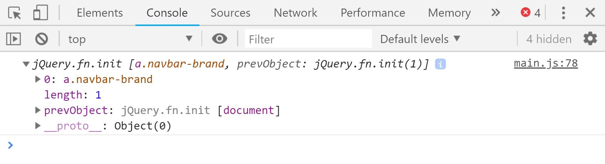
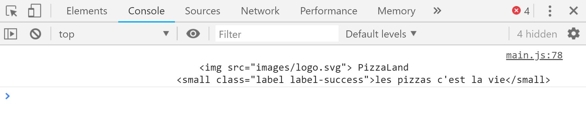
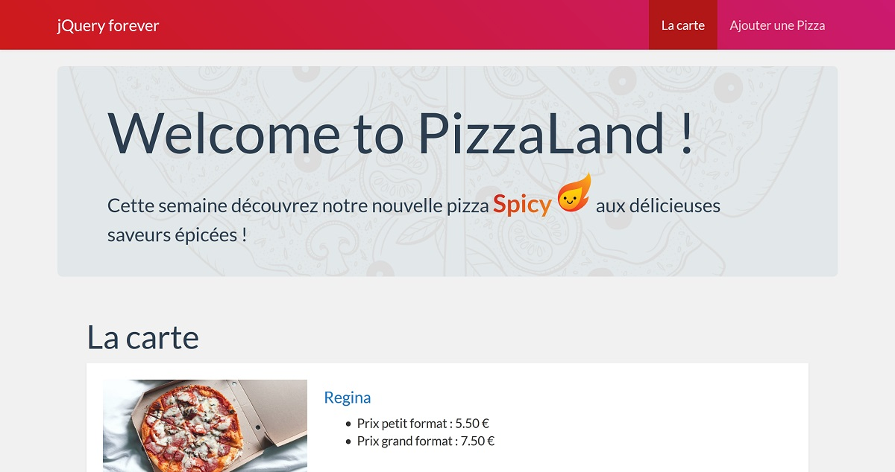
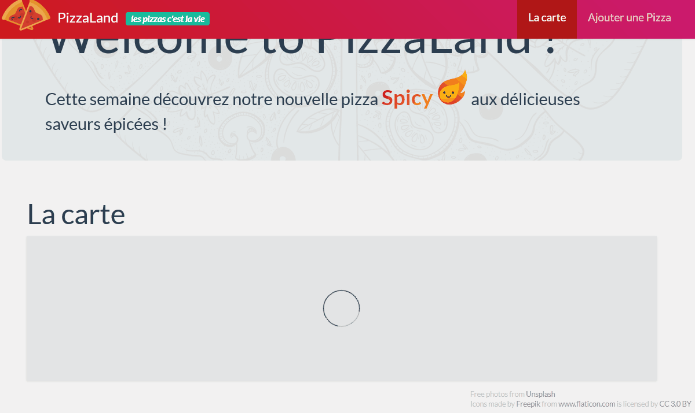
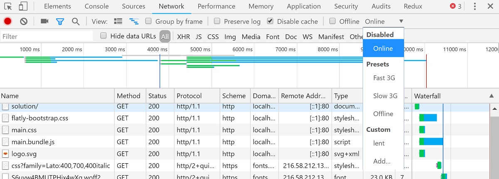

#### TP4 - AJAX - jQuery <!-- omit in toc -->
# B. JQUERY <!-- omit in toc -->

## Sommaire <!-- omit in toc -->
- [B.1. Installation de jQuery](#b1-installation-de-jquery)
- [B.2. la fonction $()](#b2-la-fonction-)
- [B.3. modifier la page](#b3-modifier-la-page)
- [B.4. les événements avec jQuery](#b4-les-événements-avec-jquery)
- [B.5. jQuery & ajax](#b5-jquery--ajax)

***Ce TP va permettre de connecter notre appli JS à une base de données distante par l'intermédiaire d'une API REST/JSON mettre en oeuvre les principales méthodes de sélection et de modification d'éléments de l'arbre DOM.***

## B.1. Installation de jQuery
1. Installez la dernière version stable de jQuery avec la commande npm suivante :
	```bash
	cd /chemin/vers/votre/dossier/demarrage
	npm install --save jquery
	```

2. **Ouvrez le fichier `package.json` et constatez que jQuery a été ajouté à la liste des dépendances du projet :**
	```bash
	  "dependencies": {
	    "jquery": "^3.3.1"
	  }
	```

3. **Une fois tout installé, vous pouvez relancer la compilation à l'aide de la commande `npm run watch`**. Vérifiez ensuite que la page s'affiche toujours correctement dans le navigateur :<br>

	<a href="images/pizzaland-ajax-fin.jpg"></a>

	Comme d'habitude, **prenez bien soin de typer <u>toutes</u> vos variables**, paramètres et valeurs de retour des fonctions et méthodes avec Flow et pensez à vérifier **régulièrement** que les types que vous utilisez sont corrects à l'aide de la commande `./node_modules/.bin/flow`

## B.2. la fonction $()
**Comme vu en cours, jquery met à disposition une fonction "magique" `$()` qui permet notamment de sélectionner des éléments HTML puis d'y appliquer des modifications.**
1. **Dans le fichier main.js, importez jQuery** :
	```js
	import $ from 'jquery';
	```

	Vous noterez que cette instruction `import` est un peu différente de celles que l'on avait faites jusque là : en effet, **quand on importe un paquet npm, on indique après le `from` juste son nom** (et pas un chemin relatif comme pour les modules que l'on développe nous-mêmes).

2. **Utilisez la fonction $ pour sélectionner le lien entourant le logo et affichez le contenu dans la console** :
	```js
	console.log( $('a.navbar-brand') );
	```

	<a href="images/jquery-console.jpg"></a>

	La valeur retournée par `$()` est un [objet jQuery](http://api.jquery.com/Types/#jQuery). Il s'agit d'un objet qui contient la liste de tous les éléments HTML correspondant au sélecteur CSS (*ici nous n'en avons qu'un seul, d'où le length = 1*) et des méthodes qui vont permettre de les manipuler.

## B.3. modifier la page
1. **Avec la méthode `.html()` affichez le contenu du lien entourant le logo** :
	```js
	console.log( $('a.navbar-brand').html() );
	```

	<a href="images/jquery-console-html.jpg"></a>

2. **La méthode `.html()` peut aussi servir à modifier le contenu d'une balise : remplacez le contenu du logo par le texte `'jQuery forever'`**. Vous devez obtenir le résultat suivant :

	<a href="images/jquery-modifier-html.jpg"></a>

3. Comme expliqué plus haut, jQuery retourne un objet qui peut contenir une collection d'éléments HTML. Si le sélecteur CSS que l'on passe à la fonction `$()` correspond à plusieurs éléments de la page, les méthodes que l'on appellera ensuite sur l'objet jQuery s'appliqueront automatiquement à tous les éléments de la page concernés !

	**Remplacez le sélecteur CSS précédent `'a.navbar-brand'` par `'a'`**. Vous devez maintenant obtenir le résultat suivant :

	<a href="images/jquery-modifier-html-collection.jpg"></a>

	Voyez comment avec **une seule instruction** on a pu modifier **tous** les liens de la page (*tout du moins tous ceux qui existaient au moment où l'on a exécuté l'instruction : ceux de la liste des pizzas ont été générés par la `HomePage` après que l'appel ajax soit terminé, ils n'ont donc pas été modifiés*). Pas besoin de `forEach` ou de boucle `for`, elle est inclue dans chaque méthode de l'objet jQuery retourné par `$()`.

4. **Effacez le code précédent de manière à revenir à une barre de menu "normale"** (avec le logo PizzaLand et les liens du menu "La carte" et "Ajouter une pizza").

5. **Un des points les plus importants lorsqu'on développe une application JS qui utilise AJAX est de donner un retour visuel (feedback) à l'utilisateur lorsqu'un chargement est en cours.**

	En effet, contrairement aux applis web classiques, lorsqu'un appel AJAX commence, le navigateur ne donne aucun indice permettant à l'utilisateur de deviner qu'il se passe quelque chose (la page ne s'efface pas, il n'y a pas de "loader" ou de barre de progression), il peut donc avoir l'impression que sa demande n'a pas été prise en compte, que le site est "planté", voire clicker frénétiquement sur un bouton pour le faire marcher (ce qui n'aura comme autre effet que de lancer autant de requêtes HTTP supplémentaires...).

	Il faut donc donner cette information à l'utilisateur nous même, en affichant par exemple un message ou une animation dans la page. C'est ce que l'on va faire : **Juste avant de lancer l'appel AJAX `GET` `/api/v1/pizzas`, ajoutez la classe CSS `is-loading` sur la balise de classe CSS `'pizzasContainer'` à l'aide de la méthode [`addClass()`](https://api.jquery.com/addClass/)** :

	<a href="images/jquery-addClass-is-loading.gif"></a>

6. **Une fois l'appel AJAX terminé et la liste des pizzas récupérées, retirer la classe CSS 'is-loading' de la balise 'pizzasContainer'** à l'aide de la méthode [`removeClass()`](https://api.jquery.com/removeClass/) :

	Comme notre serveur REST se trouve sur notre machine, le délai de chargement est très rapide, on a donc à peine le temps de voir le loader apparaître.

	La solution est d'utiliser le système de bridage de bande passante intégrée aux devtools du navigateur. Par exemple sur Chrome :

	<a href="images/chrome-throttle.jpg"></a>

	Sélectionnez `Fast 3G` ou `Slow 3G` et rechargez la page pour voir l'impact sur l'affichage.

## B.4. les événements avec jQuery
1. **A l'aide de la méthode [`.on()`](https://api.jquery.com/on/) détectez le clic sur le logo du menu et affichez la `homePage`**
2. **A l'aide de la méthode [`.click()`](https://api.jquery.com/click/) faites en sorte que lorsqu'on clique sur une pizza, on affiche l'image de la pizza dans une popup** :
	- la fonction passée à `.click()` reçoit en paramètre un objet [event](http://api.jquery.com/category/events/event-object/) avec (comme dans l'API DOM) une propriété [`currentTarget`](http://api.jquery.com/event.currentTarget/) et une méthode [`preventDefault()`](http://api.jquery.com/event.preventDefault/)
	- l'ouverture d'une popup en JS se fait avec la méthode [`window.open`](https://developer.mozilla.org/en-US/docs/Web/API/Window/open). On peut masquer les barres de menu de la fenêtre et changer la taille de la popup à l'aide d'un 3e paramètre comme celui-ci : `'width=350,height=200,menubar=0,toolbar=0,location=0,personalbar=0,status=0'`

<!--
## B.5. jQuery & ajax
ajax pour la liste des ingrédients

redirection vers liste après chargement
page détail -->

